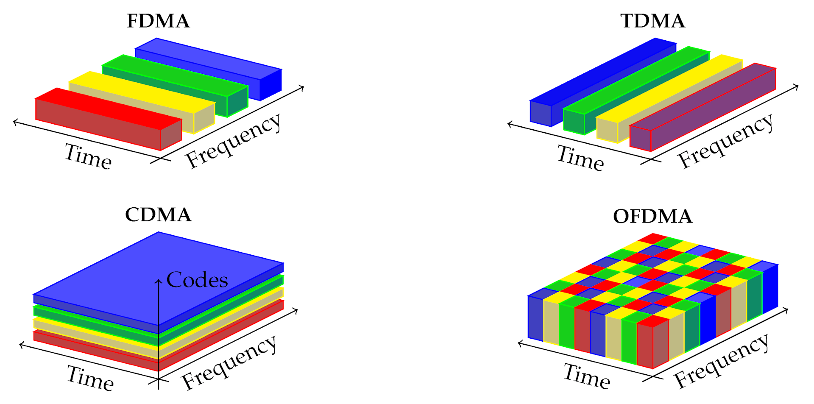
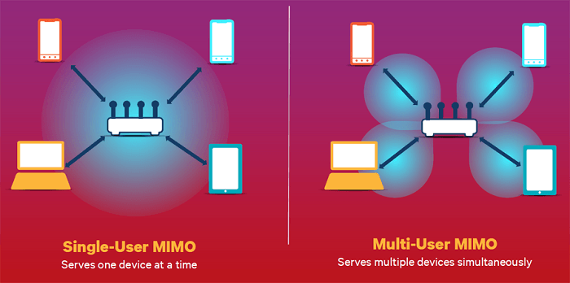

  <figure class="access-figure" tabindex="0">
    
    <figcaption>Слева направо, сверху вниз: FDMA разделяет частоты, TDMA — время, CDMA — коды, OFDMA назначает клетки сетки время × частота. Иллюстрация из <a href="https://theconversation.com/what-is-3g-and-why-is-it-being-shut-down-an-electrical-engineer-explains-176781">The Conversation</a>, <a href="https://creativecommons.org/licenses/by-sa/4.0/">CC BY-SA 4.0</a>; изображение не изменено.</figcaption>
  </figure>
  <figure class="access-figure access-figure-mimo" tabindex="0">
    
    <figcaption>Разница между обслуживанием одного и нескольких пользователей: при MU-MIMO пространственные потоки могут идти одновременно. Изображение: <a href="https://www.everythingrf.com/community/what-is-mu-mimo">everything RF</a>.</figcaption>
  </figure>

Изображения схематичны: условия разделения пространственных потоков и помехи на них не показаны. На узком экране рисунки можно прокручивать по горизонтали.

