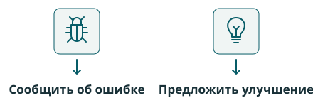

::: {.home-cover}
::: {.home-overline}
ОПИСиС · Учебный курс
:::

# Основы построения инфокоммуникационных систем и сетей {.home-title .unnumbered}

::: {.home-subtitle}
От физического сигнала до сквозной доставки информации через сеть
:::

[Начать изучение →](lectures/00-introduction.qmd){.home-start}


:::

## О курсе

Как информация становится физическим сигналом, проходит через каналы связи, промежуточные узлы и транспортную инфраструктуру — и достигает получателя? Курс посвящён принципам построения инфокоммуникационных систем и сетей и инженерным задачам, которые стоят за этим путём.

Мы рассмотрим передачу данных, использование ограниченных ресурсов, обеспечение надёжности, организацию доступа и доставки информации через сеть. Wi-Fi, 5G, Ethernet, IP, SDH и другие технологии послужат примерами разных способов решения этих задач.

## Материалы курса

```{=html}
<div class="home-materials">
<a class="home-material" href="lectures/index.qmd"><i class="bi bi-book" aria-hidden="true"></i><span class="home-material-title">Лекции</span><span>Теоретические материалы, инженерные принципы и примеры реальных систем.</span><span class="home-material-action" aria-hidden="true">Открыть лекции →</span></a>
<a class="home-material" href="practice/index.qmd"><i class="bi bi-pencil-square" aria-hidden="true"></i><span class="home-material-title">Практические занятия</span><span>Расчётные задачи, анализ систем и сравнение инженерных решений.</span><span class="home-material-action" aria-hidden="true">Перейти к практике →</span></a>
<a class="home-material" href="labs/index.qmd"><i class="bi bi-beaker" aria-hidden="true"></i><span class="home-material-title">Лабораторные работы</span><span>Эксперименты, исследование характеристик и поведения систем.</span><span class="home-material-action">Материалы готовятся →</span></a>
<a class="home-material" href="reference/models.qmd"><i class="bi bi-sliders" aria-hidden="true"></i><span class="home-material-title">Интерактивные модели</span><span>Симуляции, динамические схемы и вычислительные эксперименты.</span><span class="home-material-action" aria-hidden="true">Выбрать эксперимент →</span></a>
</div>
```

## Содержание курса

::: {.home-topics}
1. **От информации к сигналу**

   Цифровое представление информации, кодирование и модуляция.

2. **Передача через реальную среду**

   Физические каналы, искажения, ошибки и надёжность.

3. **Совместное использование ресурсов**

   Мультиплексирование, множественный доступ, синхронизация и организация передачи.

4. **От канала к сети**

   Агрегация, транспорт, коммутация, кадры и маршрутизация.

5. **Сквозная инфокоммуникационная система**

   Объединение изученных механизмов в единую архитектуру доставки данных.
:::

[Все темы курса →](lectures/index.qmd){.home-text-link}

## Информация о дисциплине

| Параметр | Значение |
|---|---|
| Направление подготовки | 11.03.02 «Инфокоммуникационные технологии и системы связи» |
| Общая трудоёмкость | 144 часа |
| Зачётные единицы | 4 з. е. |
| Форма промежуточной аттестации | Экзамен |

## Трудоёмкость дисциплины

Все значения приведены в академических часах.

```{=html}
<div class="home-hours" role="img" aria-label="Распределение 144 академических часов: лекции — 26, практика — 18, лабораторные — 16, самостоятельная работа — 48, подготовка и сдача экзамена — 36.">
<span class="hours-lectures" style="flex:26" title="Лекции — 26 часов"></span><span class="hours-practice" style="flex:18" title="Практические занятия — 18 часов"></span><span class="hours-labs" style="flex:16" title="Лабораторные работы — 16 часов"></span><span class="hours-self" style="flex:48" title="Самостоятельная работа — 48 часов"></span><span class="hours-exam" style="flex:36" title="Подготовка и сдача экзамена — 36 часов"></span>
</div>
```

<table class="table home-hours-table">
<thead><tr><th scope="col">Вид учебной работы</th><th scope="col">Часы</th></tr></thead>
<tbody>
<tr><th scope="row"><span class="hours-key hours-lectures" aria-hidden="true"></span>Лекции</th><td>26</td></tr>
<tr><th scope="row"><span class="hours-key hours-practice" aria-hidden="true"></span>Практические занятия</th><td>18</td></tr>
<tr><th scope="row"><span class="hours-key hours-labs" aria-hidden="true"></span>Лабораторные работы</th><td>16</td></tr>
<tr><th scope="row"><span class="hours-key hours-self" aria-hidden="true"></span>Самостоятельная работа</th><td>48</td></tr>
<tr><th scope="row"><span class="hours-key hours-exam" aria-hidden="true"></span>Подготовка и сдача экзамена</th><td>36</td></tr>
</tbody>
<tfoot><tr><th scope="row">Всего</th><td><strong>144</strong></td></tr></tfoot>
</table>

## Рекомендуемая литература и ресурсы

::: {.home-reading}
Основные учебные материалы курса размещаются непосредственно на этом сайте и постепенно дополняются. Рекомендуемая литература помогает глубже изучить отдельные вопросы, познакомиться с альтернативными объяснениями и расширить профессиональный кругозор.

Для освоения обязательного содержания дисциплины предварительное чтение перечисленных учебников не требуется. Это три рекомендуемых источника; список может расширяться по мере разработки тем.

### Скляр — цифровые системы связи

**Скляр Б. Цифровая связь. Теоретические основы и практическое применение.** 2-е изд. — Москва: Вильямс, 2018. ISBN 978-5-8459-2071-3.

[Страница книги у российского издательства «Вильямс»](https://www.williamspublishing.com/Books/978-5-8459-2071-3.html).

Оригинальное название: *Digital Communications: Fundamentals and Applications*.

Полезна для изучения цифрового представления и передачи информации, сигналов и спектров, цифровой модуляции, шума и помех, помехоустойчивости и общих принципов построения цифровых систем связи.

### Прокис — математические модели передачи

**Прокис Дж. Цифровая связь.** Перевод с английского под редакцией Д. Д. Кловского. — Москва: Радио и связь, 2000. ISBN 5-256-01434-X.

[Библиографическая запись Российской государственной библиотеки](https://search.rsl.ru/ru/record/01000683910).

Оригинальное название: *Digital Communications*.

Полезна для углублённого изучения математических моделей цифровой передачи, анализа сигналов, каналов связи и модуляции, оценки качества передачи и методов повышения надёжности.

### Таненбаум, Фимстер и Уэзеролл — компьютерные сети

**Таненбаум Э., Фимстер Н., Уэзеролл Д. Компьютерные сети.** 6-е изд. — Санкт-Петербург: Питер, 2023. ISBN 978-5-4461-1766-6.

[Страница книги у российского издательства «Питер»](https://www.piter.com/product/kompyuternye-seti-6-e-izd).

Оригинальное название: *Computer Networks*.

Полезна для изучения архитектуры сетей, канального и сетевого уровней, коммутации пакетов, адресации, маршрутизации и организации доставки данных.

### Открытые ресурсы

- **ITU-T G.711 — импульсно-кодовая модуляция речи.** Стандарт для сопоставления учебной модели компандирования с телефонной ИКМ.
- **MIT 6.02: Media Access Control Protocols.** Учебные эксперименты с TDMA, Aloha и CSMA; материал на английском языке.
- [Справочник курса](reference/index.qmd). Краткие объяснения децибел, комплексных чисел и дискретизации, к которым удобно возвращаться во время занятий.
:::

## Как пользоваться курсом

Лекционные страницы организованы по темам, а не по календарным занятиям. Практика помогает применять изученные принципы, лабораторные работы предназначены для экспериментов и проверки гипотез, а интерактивные модели — для самостоятельного исследования поведения систем. Материалы постепенно дополняются и обновляются.

## Обратная связь

Нашли неточность или придумали, как сделать объяснение понятнее? Сообщения помогают исправлять материалы и выбирать полезные дополнения к курсу. Для этого в правом верхнем углу главной есть две кнопки:

```{=html}
<figure class="home-feedback-guide">

<figcaption>Эти значки находятся рядом с переключателем темы и поиском.</figcaption>
</figure>
<div class="home-feedback-options">
<section aria-labelledby="feedback-error">
<h3 id="feedback-error"><i class="bi bi-bug" aria-hidden="true"></i> Сообщить об ошибке</h3>
<p>Опечатка, неверная формула, неработающая ссылка или модель ведёт себя не так, как описано. Укажите страницу, что произошло и какой результат ожидался. Для модели добавьте параметры и шаги воспроизведения.</p>
<a data-issue-template="bug_report.yml" href="https://github.com/temaSW/intro-to-networking/issues/new?template=bug_report.yml" target="_blank" rel="noopener noreferrer">Открыть форму ошибки →</a>
</section>
<section aria-labelledby="feedback-improvement">
<h3 id="feedback-improvement"><i class="bi bi-lightbulb" aria-hidden="true"></i> Предложить улучшение</h3>
<p>Не хватает примера, хочется исследовать другой сценарий или есть идея для объяснения. Укажите тему и расскажите, какую задачу решит дополнение и что предлагаете изменить.</p>
<a data-issue-template="feature_request.yml" href="https://github.com/temaSW/intro-to-networking/issues/new?template=feature_request.yml" target="_blank" rel="noopener noreferrer">Открыть форму предложения →</a>
</section>
</div>
```

Формы открываются на GitHub; для отправки нужен аккаунт. Обсуждения публичны — не включайте персональные данные и закрытые материалы. Предложения рассматриваются по мере развития курса.
