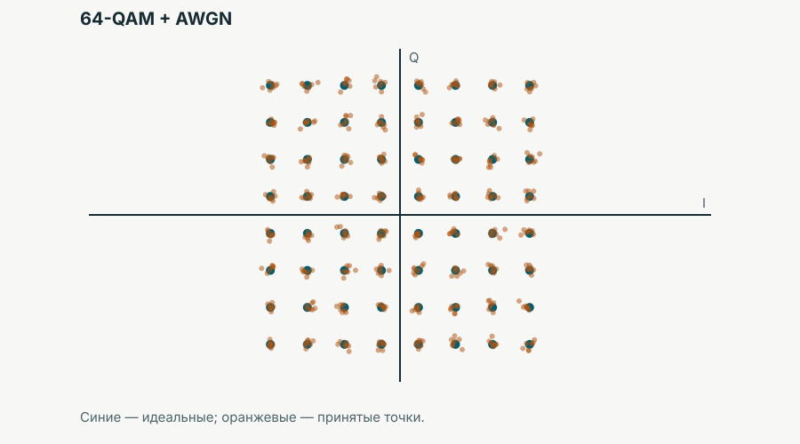

::: {.engineering-problem}
## Одна инженерная ситуация на всю лекцию

Есть поток `011010011…`. Для его передачи доступен физический канал с ограниченными полосой, временем и мощностью; в канале есть шум. Сначала поток один. Потом одновременно передавать хотят Alice и Bob. Потом оказывается, что их каналы различаются.

Вопрос лекции: **как распорядиться ограниченным, общим и ненадёжным физическим ресурсом?**
:::

## Результат к концу занятия

После лекции студент должен уметь связать три решения с одной задачей:

| Что ограничено? | Какая «ручка» системы? | Что она меняет? |
|:--|:--|:--|
| Информация в одном символе | порядок модуляции $M$, $Q_m$ | потенциальную скорость и требования к каналу |
| Общий физический ресурс | доля пользователя $
ho_u$ | кому достаётся время и частота |
| Надёжность в шуме | code rate $R_c$ | долю избыточности и полезную скорость |

К концу занятия также нужны: бит, символ, QPSK/QAM, FEC, code rate, FDMA/TDMA/OFDMA, scheduler и MCS. Детали LDPC/Polar, алгоритмов scheduler, HARQ, MIMO и структуры NR frame остаются за границей этой лекции.

## Маршрут на 85–90 минут

1. **Один поток, один шумный канал** — 25 минут.
2. **Несколько пользователей, один ресурс** — 25 минут.
3. **Разные каналы и цена надёжности** — 25 минут.
4. **Единая модель и инженерская ситуация** — 15 минут.

## Акт I — один поток хочет стать физическим сигналом

::: {.predict}
## Вопрос перед термином

На входе передатчика — биты. Физический канал не «видит» нули и единицы. Какие различимые состояния сигнала можно использовать, чтобы получатель восстановил данные?

Не просить определения модуляции. Дать минуту на гипотезы: разные амплитуды, фазы, частоты или их комбинации.
:::

Если передатчик и приёмник договорились о $M$ различимых состояниях, один переданный выбор из этих состояний называют **символом**. При степенях двойки он переносит

$$Q_m = log_2 M$$

бит. Поэтому два состояния дают 1 бит на символ, четыре — 2, а шестнадцать — 4. Биты не «ускорились сами»: мы договорились различать больше состояний физического сигнала.

::: {.figure}
**Биты → состояния → символ**

```{=html}
<div class="states-diagram" role="img" aria-label="Два, четыре и шестнадцать различимых состояний соответствуют одному, двум и четырём битам на символ">
  <div><strong>2 состояния</strong><span class="state-row"><i></i><i></i></span><b>1 bit/symbol</b></div>
  <div><strong>4 состояния</strong><span class="state-row"><i></i><i></i><i></i><i></i></span><b>2 bit/symbol</b></div>
  <div><strong>16 состояний</strong><span class="state-row many"><i></i><i></i><i></i><i></i><i></i><i></i><i></i><i></i></span><b>4 bit/symbol</b></div>
</div>
```
:::

### QPSK и QAM: знакомые сигналы, новая инженерная роль

В QPSK символ выбирается из четырёх фазовых состояний. В QAM различаются сочетания двух координат сигнала; на диаграмме созвездия каждая точка — допустимый символ. Здесь не выводим BER и не повторяем курс сигналов: диаграмма нужна, чтобы увидеть цену плотной упаковки состояний.

| QPSK | 16-QAM | 64-QAM |
|:--:|:--:|:--:|
| {fig-alt="Четыре точки QPSK на плоскости I-Q"} | {fig-alt="Шестнадцать точек 16-QAM на плоскости I-Q"} | {fig-alt="Шестьдесят четыре точки 64-QAM на плоскости I-Q"} |

::: {.predict}
## Почему не всегда 4096-QAM?

Представьте, что диапазон амплитуд и мощность не бесконечны. Что происходит с расстоянием между точками, когда в ту же область помещают 64, 256, 1024… состояний? Какая ошибка приёмника становится вероятнее при том же шуме?
:::

При фиксированном доступном диапазоне точки сближаются. Шум, фазовая ошибка и неточность тракта легче переносят принятую точку в область соседнего символа. Поэтому $M\uparrow$ действительно даёт $Q_m\uparrow$, но требует лучшего качества канала.

::: {.experiment}
## Интерактив 1 — constellation + AWGN

**Сценарий:** поставить QPSK при выбранном SNR, попросить прогноз; сохранить SNR и включить 64-QAM; обсудить ошибки решений. На странице пока размещён воспроизводимый статический кадр, а публичная карточка будущего компонента — [«Интерактивы лекции 04»](04-interactives.qmd#constellation-awgn).

{fig-alt="Идеальные точки 64-QAM и облака принятых точек при аддитивном белом гауссовском шуме"}
:::

### Масштаб реальных порядков QAM

| Модуляция | bit/symbol |
|:--|--:|
| QPSK | 2 |
| 16-QAM | 4 |
| 64-QAM | 6 |
| 256-QAM | 8 |
| 1024-QAM | 10 |
| 4096-QAM | 12 |
| 8192-QAM | 13 |
| 16384-QAM<sup>†</sup> | 14 |

<sup>†</sup> Верхняя ориентировочная отметка для high-order QAM: не следует читать её как режим, одинаково предусмотренный Wi‑Fi 7 или базовой 5G NR MCS table. Для microwave equipment 16384-QAM встречается в материалах производителей как перспективная/специализированная возможность; перед финальной редакцией стоит заменить эту формулировку на конкретный подтверждённый product reference либо оставить её именно с этим ограничением.

4096-QAM предусмотрена Wi‑Fi 7: это 12, а не 10 bit/symbol по сравнению с 1024-QAM. Это режим при достаточно хорошем канале, а не обещание такой модуляции каждому устройству всегда. [Qualcomm: Wi‑Fi 7 and 4K QAM](https://www.qualcomm.com/wi-fi/wi-fi-7) приводит это сравнение для Wi‑Fi 7.

В 5G NR 1024-QAM присутствует в дополнительной таблице MCS для PDSCH (ниже используется именно она). Для microwave backhaul производители заявляли 8192-QAM; например, [Huawei в описании microwave bearer solution](https://www.huawei.com/en/news/2017/10/Huawei-5G-Microwave-Bearer-Solution) прямо называет 8192QAM. Ограничение для 16384-QAM вынесено прямо в таблицу, чтобы не смешивать математический масштаб с обязательным режимом конкретного стандарта.

::: {.figure-explanation}
## Фундаментальный ориентир: Шеннон

{fig-alt="Кривая C делить на B как функция SNR от минус 10 до 35 децибел"}

$$\eta_{\mathrm{Shannon}} = \frac{C}{B}=\log_2(1+\mathrm{SNR}).$$

При 0 dB это 1 bit/s/Hz, при 10 dB — примерно 3.46, при 20 dB — 6.66, при 30 dB — 9.97. В области большого SNR добавка около 3 dB даёт примерно ещё 1 bit/s/Hz. Это не формула реального throughput и не таблица выбора MCS: это верхний ориентир для идеализированного канала.
:::

## Акт II — тот же ресурс нужен Alice и Bob

Alice хочет передать `011010…`, Bob — `110001…`. Они не могут одновременно бесплатно занять один и тот же элемент времени и частоты.

::: {.predict}
## Пустой ресурс

Как дать двум пользователям общий канал? Пусть сначала каждый предложит решение без терминов. После ответов назвать уже найденные идеи.
:::

| Делим частоту | Делим время |
|:--|:--|
| `Alice ────── │ Bob ──────`<br>Разные полосы одновременно → **FDMA**. | `Alice ─── → Bob ─── → Alice`<br>Одна полоса по очереди → **TDMA**. |

В реальных системах удобно увидеть ресурс двумерно: горизонталь — время, вертикаль — частота. Разделение клеток сетки между пользователями — интуиция **OFDMA**. 5G NR — пример системы с таким ресурсным представлением; сейчас не изучаем формат его frame.

::: {.figure}
## Time–frequency grid

```{=html}
<div class="tf-grid" role="img" aria-label="Сетка времени и частоты с клетками, назначенными Alice, Bob и Carol">
  <span class="axis-y">частота ↑</span><span class="axis-x">время →</span>
  <i class="alice"></i><i class="alice"></i><i class="bob"></i><i class="bob"></i><i class="carol"></i><i class="carol"></i>
  <i class="alice"></i><i class="alice"></i><i class="bob"></i><i class="bob"></i><i class="carol"></i><i class="carol"></i>
  <i class="alice"></i><i class="bob"></i><i class="bob"></i><i class="carol"></i><i class="carol"></i><i class="carol"></i>
  <i class="empty"></i><i class="bob"></i><i class="bob"></i><i class="carol"></i><i class="empty"></i><i class="empty"></i>
</div>
<div class="grid-legend"><span class="alice">Alice</span><span class="bob">Bob</span><span class="carol">Carol</span><span class="empty">свободно</span></div>
```

Одна клетка одновременно принадлежит не более чем одному пользователю в этой ортогональной модели.
:::

### Статически поровну — не всегда эффективно

::: {.predict}
## Всем по 25%?

Alice имеет большой backlog, Bob — короткую передачу, Carol — среднюю, Dave сейчас ничего не передаёт. Что потеряет система, если каждому навсегда закрепить четверть сетки?
:::

Статическое разделение оставляет клетки Dave неиспользованными, пока Alice ждёт. При динамическом распределении система может отдавать свободные клетки тем, у кого есть данные и для кого передача сейчас возможна. Функциональное имя компонента, который принимает такое решение: **scheduler**. Алгоритм намеренно не выбираем: scheduler решает *кому и какую часть доступного физического ресурса предоставить*.

::: {.experiment}
## Интерактив 2 — resource grid

Будущая модель показывает backlog нескольких пользователей, static/dynamic allocation и вручную распределяемые клетки. Главный опыт: клетку, отданную Alice, нельзя одновременно отдать Bob без дополнительного механизма. Карточка компонента: [«Интерактивы лекции 04»](04-interactives.qmd#resource-grid).
:::

## Акт III — одинаковые клетки, разная информационная ценность

Теперь Alice близко к базовой станции и имеет высокий SNR; Bob далеко и его SNR ниже.

::: {.predict}
## Одинаковая модуляция для всех?

Справедливо ли выдавать Alice и Bob одинаковый $Q_m$? Вернитесь мысленно к двум запускам constellation + AWGN. Что будет разумнее выбрать для Bob?
:::

Одинаковый физический ресурс может иметь различную информационную ценность при разном состоянии канала. Система измеряет или оценивает channel state и выполняет **link adaptation**: среди прочего выбирает подходящие модуляцию и кодирование.

### Ошибки остаются: зачем добровольно передавать больше?

Понизить порядок QAM — не единственный ответ на шум. Студенты обычно предложат повысить мощность, передавать медленнее, повторить данные или добавить избыточность. Повторение удобно только как первая модель:

```text
0 → 000
1 → 111
```

Если один из трёх бит испорчен, большинство ещё позволяет угадать исходный бит. Но за один информационный бит заняли три физические позиции. В общем виде:

$$k\ \text{information bits}\quad\longrightarrow\quad\boxed{\mathrm{FEC}}\quad\longrightarrow\quad n\ \text{coded bits},\qquad R_c=\frac{k}{n}.$$

**FEC** — помехоустойчивое кодирование. При меньшем $R_c$ больше избыточности и обычно выше устойчивость, но меньше доля полезных данных. LDPC и Polar — реальные примеры кодов; их устройство изучать сейчас не будем.

::: {.experiment}
## Интерактив 3 — modulation + coding + channel

Перед переходом $R_c=5/6\rightarrow1/2$ спросить: что изменится в useful rate и в устойчивости? Затем проверить на модели. В модели необходимо явно маркировать её допущения и не выдавать результат за 5G BLER. Карточка компонента: [«Интерактивы лекции 04»](04-interactives.qmd#modulation-coding).
:::

## MCS: система выдаёт не бесконечную ручку, а набор режимов

После появления $Q_m$ и $R_c$ естественно назвать их комбинацию: **modulation and coding scheme (MCS)**. Для примера используем *MCS index table 4 for PDSCH*, Table 5.1.3.1-4 из [ETSI TS 138 214 V18.9.0 / 3GPP TS 38.214](https://www.etsi.org/deliver/etsi_ts/138200_138299/138214/18.09.00_60/ts_138214v180900p.pdf), p. 39. В ней `Target code rate` приведён как $R\times1024$: например, 853 означает $R_c=853/1024\approx0.833$.

| $I_{\mathrm{MCS}}$ | $Q_m$ | $R_c$ | $\eta\approx Q_mR_c$ |
|--:|--:|--:|--:|
| 0 | 2 | 120/1024 | 0.2344 |
| 3 | 4 | 378/1024 | 1.4766 |
| 6 | 6 | 466/1024 | 2.7305 |
| 15 | 8 | 682.5/1024 | 5.3320 |
| 23 | 10 | 805.5/1024 | 7.8662 |
| 26 | 10 | 948/1024 | 9.2578 |

Переход с $I_{\mathrm{MCS}}=14$ на 15 меняет 64-QAM на 256-QAM, но code rate при этом падает с $873/1024$ до $682.5/1024$. Поэтому спектральная эффективность растёт с 5.1152 лишь до 5.3320 bit/s/Hz, а не на «целые два бита». Это полезнее запоминания названий строк таблицы.

{fig-alt="Ступенчатый график спектральной эффективности против индекса MCS от 0 до 26 с зонами QPSK, 16-QAM, 64-QAM, 256-QAM и 1024-QAM"}

Два графика отвечают на **разные** вопросы:

```text
Shannon:  какой фундаментальный предел задаёт SNR?
MCS:      какие дискретные режимы предоставляет конкретная система?

channel state → link adaptation → choose MCS
```

Стандарт не задаёт универсальное соответствие MCS↔SNR. Для такого графика потребовались бы конкретные модель канала, target BLER и link-level simulation или dataset. Здесь такого соответствия намеренно нет.

## Собираем одну учебную модель

Пусть $R_s$ — символьная скорость, а $
ho_u$ — доля физического ресурса, отданная пользователю. Тогда полезную скорость можно оценить так:

$$R_u\approx R_s\rho_uQ_mR_c.$$

```text
ρᵤ       → allocation / multiple access
Qₘ       → modulation
R_c      → FEC
```

Это **учебная оценка**, не точная формула 5G throughput. В ней пока нет reference signals, control overhead, guard intervals, retransmissions, resource elements без user data и иных потерь.

::: {.model}
## Быстрая проверка здравого смысла

$$
\begin{aligned}
R_s&=20\ \text{Msymbol/s}, & \rho_u&=\frac14,\\
M&=16\Rightarrow Q_m=4, & R_c&=\frac34.
\end{aligned}
$$

$$R_u\approx20\cdot\frac14\cdot4\cdot\frac34=15\ \text{Mbit/s}.$$

**Вопрос после вычисления:** как увеличить скорость? Возможны три ответа: увеличить долю ресурса, порядок модуляции или code rate. **Почему нельзя просто увеличить все три?** Потому что ресурс общий, высокий $Q_m$ требует лучшего канала, а высокий $R_c$ оставляет меньше защиты от ошибок.
:::

## Финальная ситуация вместо summary-slide

Alice смотрит видео и уходит дальше от базовой станции: её SNR снижается. Одновременно появляются ещё 20 активных пользователей.

::: {.predict}
## Три ручки системы

Что может сделать система с

$$\rho_u,\qquad Q_m,\qquad R_c?$$

Ожидаемые рассуждения: уменьшить modulation order; выбрать более сильное кодирование; при необходимости дать Alice больше ресурса; признать, что это уменьшит ресурс других. Если требования всех пользователей не помещаются в физический ресурс, полезную скорость придётся снизить.
:::

::: {.takeaway}
## Главная мысль

Модуляция отвечает, **сколько** информации несёт символ; распределение ресурса — **кому** достаются время и частота; кодирование — **какую часть потенциальной скорости** система отдаёт ради надёжности. Это не три независимые темы, а три связанных решения одной инженерной задачи.
:::

## Источники и воспроизводимость

- Данные и график MCS: [ETSI TS 138 214 V18.9.0 (2026-04), Table 5.1.3.1-4, p. 39](https://www.etsi.org/deliver/etsi_ts/138200_138299/138214/18.09.00_60/ts_138214v180900p.pdf). Исходные значения: [nr-mcs-table-4.csv](../data/lecture-04/nr-mcs-table-4.csv).
- 1024-QAM также явно упомянута ETSI в [TS 138 331, указание на Table 5.1.3.1-4 TS 38.214](https://www.etsi.org/deliver/etsi_ts/138300_138399/138331/18.01.00_60/ts_138331v180100p.pdf).
- Wi‑Fi 7 / 4096-QAM: [Qualcomm Wi‑Fi 7](https://www.qualcomm.com/wi-fi/wi-fi-7).
- Microwave / 8192-QAM: [Huawei 5G Microwave Bearer Solution](https://www.huawei.com/en/news/2017/10/Huawei-5G-Microwave-Bearer-Solution).
- Все SVG этой лекции генерируются без сторонних пакетов: `python scripts/lecture-04/generate_assets.py`.
