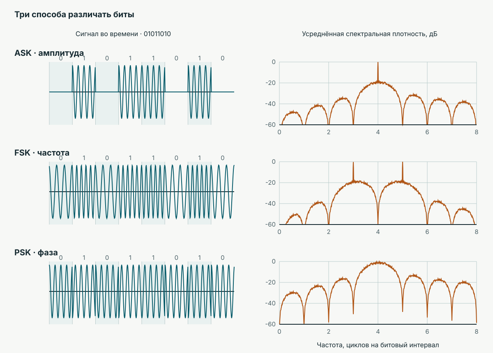
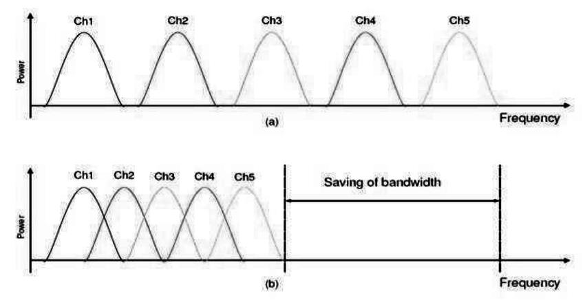

Смартфон передаёт данные по общему радиоканалу. Качество приёма и число активных пользователей меняются.

> От каких физических и организационных решений зависит полезная скорость одного пользователя?

## Как передать бит в полосе канала?

> Посмотрите на три способа передачи одной и той же последовательности битов. Что у несущей меняется между соседними битами?

#### Три способа передать бит

Что меняется у несущей?

#### Амплитуда · ASK

**ASK** (*amplitude-shift keying*) — амплитудная манипуляция.

Где сигнал становится сильнее?

#### Частота · FSK

**FSK** (*frequency-shift keying*) — частотная манипуляция.

Где колебаний за битовый интервал больше?

#### Фаза · PSK

**PSK** (*phase-shift keying*) — фазовая манипуляция.

Где меняется положение колебания?

#### Три параметра

Сравните ответы с исходной гипотезой.

$T_b$ — длительность бита, $f_c$ — несущая частота.

  
Одна последовательность битов ASK / FSK / PSK

  

  

<picture class="keying-slide" data-keying="ask"><source media="(max-width: 760px)" srcset="../assets/lecture-04/keying-ask-mobile.svg"></picture>
<picture class="keying-slide" data-keying="fsk"><source media="(max-width: 760px)" srcset="../assets/lecture-04/keying-fsk-mobile.svg"></picture>
<picture class="keying-slide" data-keying="psk"><source media="(max-width: 760px)" srcset="../assets/lecture-04/keying-psk-mobile.svg"></picture>
  

  
ASK · FSK · PSK

  
00 / 03

#### Предскажите изменение спектра

> Что произойдёт со спектром при сокращении $T_b$? Сначала предскажите результат, затем проверьте его на модели.

#### Что показывает модель?

Модель использует прямоугольные битовые импульсы; ось частоты отсчитывается от несущей. Реальный спектр также зависит от формирования импульсов и фильтрации.

Спектры манипуляции

## Сколько бит несёт состояние сигнала?

**QPSK** (*quadrature phase-shift keying*) — квадратурная фазовая манипуляция; **QAM** (*quadrature amplitude modulation*) — квадратурная амплитудная модуляция. $I$ и $Q$ — синфазная и квадратурная координаты сигнала.

  <figure><figcaption>QPSK · 2 бита на символ</figcaption></figure>
  <figure><figcaption>16-QAM · 4 бита на символ</figcaption></figure>
  <figure><figcaption>64-QAM · 6 бит на символ</figcaption></figure>

### Как подписать точки битами? Код Грея

Один и тот же набор точек можно подписать битами по-разному. В квадратной **16-QAM** символ содержит четыре бита: первые два задают уровень по оси $I$, последние два — по оси $Q$. Нуль находится в пересечении осей, а уровни каждой координаты равны $-3$, $-1$, $+1$, $+3$. Слева направо и снизу вверх они подписаны в порядке Грея `00`, `01`, `11`, `10`. Ниже показаны все точки; черта в метке разделяет биты $I$ и $Q$.

<figure class="gray-code-figure">
<svg class="gray-code-strip" viewBox="0 0 700 550" role="img" aria-label="Полное созвездие 16-QAM с четырёхбитными метками Грея. Соседние точки 01|01 и 11|01 отличаются одним битом">
  <title>Код Грея на всех шестнадцати точках 16-QAM</title>
  <rect width="700" height="550" fill="var(--surface)"/>
  <text x="105" y="35" class="gray-code-muted">Метка точки: I | Q</text>
  <path d="M160 85 V460 M285 85 V460 M410 85 V460 M535 85 V460 M160 85 H535 M160 210 H535 M160 335 H535 M160 460 H535" fill="none" stroke="var(--line)" stroke-width="1" stroke-dasharray="4 5"/>
  <line x1="70" y1="272.5" x2="630" y2="272.5" class="gray-code-axis"/>
  <path d="M630 272.5 l-10 -5 v10 z" class="gray-code-axis-arrow"/>
  <line x1="347.5" y1="510" x2="347.5" y2="47" class="gray-code-axis"/>
  <path d="M347.5 47 l-5 10 h10 z" class="gray-code-axis-arrow"/>
  <text x="647" y="277" class="gray-code-muted">I</text>
  <text x="359" y="42" class="gray-code-muted">Q</text>
  <text x="337" y="292" text-anchor="end" class="gray-code-muted">0</text>
  <text x="160" y="260" text-anchor="middle" class="gray-code-muted">−3</text>
  <text x="285" y="260" text-anchor="middle" class="gray-code-muted">−1</text>
  <text x="410" y="260" text-anchor="middle" class="gray-code-muted">+1</text>
  <text x="535" y="260" text-anchor="middle" class="gray-code-muted">+3</text>
  <text x="359" y="101" class="gray-code-muted">+3</text>
  <text x="359" y="226" class="gray-code-muted">+1</text>
  <text x="359" y="351" class="gray-code-muted">−1</text>
  <text x="359" y="476" class="gray-code-muted">−3</text>
  <line x1="285" y1="335" x2="410" y2="335" class="gray-code-highlight"/>
  <text x="160" y="64" text-anchor="middle">00|10</text><circle cx="160" cy="85" r="5"/>
  <text x="285" y="64" text-anchor="middle">01|10</text><circle cx="285" cy="85" r="5"/>
  <text x="410" y="64" text-anchor="middle">11|10</text><circle cx="410" cy="85" r="5"/>
  <text x="535" y="64" text-anchor="middle">10|10</text><circle cx="535" cy="85" r="5"/>
  <text x="160" y="189" text-anchor="middle">00|11</text><circle cx="160" cy="210" r="5"/>
  <text x="285" y="189" text-anchor="middle">01|11</text><circle cx="285" cy="210" r="5"/>
  <text x="410" y="189" text-anchor="middle">11|11</text><circle cx="410" cy="210" r="5"/>
  <text x="535" y="189" text-anchor="middle">10|11</text><circle cx="535" cy="210" r="5"/>
  <text x="160" y="314" text-anchor="middle">00|01</text><circle cx="160" cy="335" r="5"/>
  <text x="285" y="314" text-anchor="middle" class="gray-code-emphasis">01|01</text><circle cx="285" cy="335" r="7" class="gray-code-emphasis-point"/>
  <text x="410" y="314" text-anchor="middle" class="gray-code-emphasis">11|01</text><circle cx="410" cy="335" r="7" class="gray-code-emphasis-point"/>
  <text x="535" y="314" text-anchor="middle">10|01</text><circle cx="535" cy="335" r="5"/>
  <text x="160" y="439" text-anchor="middle">00|00</text><circle cx="160" cy="460" r="5"/>
  <text x="285" y="439" text-anchor="middle">01|00</text><circle cx="285" cy="460" r="5"/>
  <text x="410" y="439" text-anchor="middle">11|00</text><circle cx="410" cy="460" r="5"/>
  <text x="535" y="439" text-anchor="middle">10|00</text><circle cx="535" cy="460" r="5"/>
</svg>
<figcaption>Выделенные соседи <code>01|01</code> и <code>11|01</code> различаются одним битом.</figcaption>
</figure>

Если шум заставит приёмник выбрать ближайшую точку по горизонтали или вертикали, ошибётся один бит. При обычной двоичной нумерации соседние уровни `01` и `10` различались бы двумя битами. Код Грея **не добавляет избыточных битов и не меняет расстояния между точками**: при той же геометрии вероятность ошибки символа остаётся прежней, но ошибка в ближайшую точку обычно портит меньше битов.

> Сколько бит могут измениться, если приёмник вместо ближайшей точки по одной оси выберет диагонального соседа?

> Как число состояний $M$ связано с числом бит на символ $Q_m$? Что случится с расстоянием между соседними точками при увеличении $M$ и той же средней мощности?

## Как оценить качество канала?

**SNR** (*signal-to-noise ratio*) — отношение мощности сигнала к мощности шума; **дБ** — децибел.

$$\mathrm{SNR}=\frac{P_s}{P_n},\qquad \mathrm{SNR}_{\mathrm{дБ}}=10\log_{10}\frac{P_s}{P_n}.$$

**Спектральная эффективность** $\eta=R/B$ — скорость передачи $R$ (бит/с) на единицу полосы канала $B$ (Гц). Для канала с аддитивным белым гауссовским шумом предел Шеннона:

$$\eta\leq\frac{C}{B}=\log_2(1+\mathrm{SNR}),$$

где $C$ — предельная скорость канала (бит/с), а SNR в формуле берётся как отношение мощностей, не в децибелах.

#### Больше бит на символ?

> При фиксированном шуме сравните QPSK и 64-QAM. Почему выбор с большим числом бит на символ может оказаться неудачным?

#### Что меняется при снижении SNR?

> Как изменится различимость состояний при снижении SNR? Что ограничивает предел Шеннона и почему он не равен скорости конкретного пользователя?

Различимость состояний

## Если потоков несколько

`Потоки → объединение → общий канал → разделение → потоки`

**Мультиплексирование** — совместное использование канала несколькими потоками. Обозначения: **FDM** (*frequency-division multiplexing*) — частотное разделение; **TDM** (*time-division multiplexing*) — временное; **WDM** (*wavelength-division multiplexing*) — разделение по длинам волн; **OFDM** (*orthogonal frequency-division multiplexing*) — разделение по ортогональным поднесущим.

> Как можно объединить данные нескольких пользователей для передачи по общему каналу?

  <figure class="multiplex-figure" tabindex="0">
    
    <figcaption>Временное и частотное мультиплексирование. Изображение: <a href="https://resources.l-p.com/glossary/tdm-time-division-multiplexing-basics-uses-benefits-guide">LINK-PP</a>.</figcaption>
  </figure>
  <figure class="multiplex-figure" tabindex="0">
    
    <figcaption>Схематическое сравнение FDM и OFDM: перекрытие поднесущих позволяет плотнее использовать полосу. Источник: <a href="https://www.researchgate.net/figure/Difference-between-OFDM-and-conventional-FDM-signals-1_fig1_268742923">рисунок на ResearchGate</a>.</figcaption>
  </figure>

## Кому достанется общий ресурс?

**Множественный доступ** — назначение ресурса независимым пользователям. **FDMA** (*frequency-division multiple access*) — доступ с частотным разделением; **TDMA** (*time-division multiple access*) — с временным; **CDMA** (*code-division multiple access*) — с кодовым; **OFDMA** (*orthogonal frequency-division multiple access*) — назначение пользователям поднесущих и временных интервалов; **SDMA** (*space-division multiple access*) — с пространственным разделением. **MU-MIMO** (*multi-user multiple-input multiple-output*) — многопользовательская передача с несколькими антеннами на передающей и приёмной сторонах.



## Что делать с ошибками?

**BER** (*bit error rate*) — доля ошибочных битов; **BLER** (*block error rate*) — доля блоков с ошибкой. **CRC** (*cyclic redundancy check*) — циклический избыточный код для обнаружения искажений; **FEC** (*forward error correction*) — помехоустойчивое кодирование; **ARQ** (*automatic repeat request*) — повторная передача по запросу; **HARQ** (*hybrid automatic repeat request*) — сочетание кодирования и повторной передачи.

$$\mathrm{BER}=\frac{N_{\text{ошибочных битов}}}{N_{\text{переданных битов}}},\qquad
\mathrm{BLER}=\frac{N_{\text{блоков с ошибкой}}}{N_{\text{переданных блоков}}}.$$

> Что из перечисленного обнаруживает ошибку, что может её исправить без нового запроса, а что требует повторной передачи? Какую цену в ресурсе платим в каждом случае?

Кодовая скорость $R_c=k/n$; $k$ — число информационных битов, $n$ — число переданных кодовых битов.

> `0 → 000 → 010 → 0`
>
> Как приёмник восстановил бит по большинству? Какова кодовая скорость? Что произойдёт, если искажены два бита?

### Ошибки при разном качестве канала

#### Как читать график?

На графике: горизонталь — SNR в децибелах, вертикаль — BER информационных битов. Сплошные кривые получены с кодированием **LDPC** (*low-density parity-check*, код с разреженной проверочной матрицей), пунктирные — без него. Модель канала использует аддитивный белый гауссовский шум (**AWGN**, *additive white Gaussian noise*).

#### Цена исправления ошибок

> Сравните QPSK без кода и с $R_c=1/2$ при BER около $10^{-3}$. Как меняется необходимое SNR? Сколько ресурса приходится на один информационный бит?

[Данные с LDPC](../data/lecture-04/nr-ber-awgn.csv) · [данные без кодирования](../data/lecture-04/uncoded-ber-awgn.csv).

Кодирование и ошибки

## Как меняется режим передачи?

**MCS** (*modulation and coding scheme*) — сочетание порядка модуляции и кодовой скорости. **NR** (*New Radio*) — радиоинтерфейс сетей пятого поколения (5G). **Адаптивная модуляция и кодирование (AMC)** — выбор режима по состоянию канала.

Для оценки до служебных затрат и повторов:

$$R_u\approx R_s\,\rho_u\,Q_m\,R_c.$$

$R_u$ — полезная скорость пользователя; $R_s$ — символьная скорость; $\rho_u$ — доля общего ресурса пользователя; $Q_m$ — бит на символ; $R_c$ — кодовая скорость.

> Пользователь удаляется от базовой станции, а число активных пользователей растёт. Какие множители формулы могут измениться? Где в рассуждении нужны SNR, планировщик ресурса, множественный доступ и повторы?

