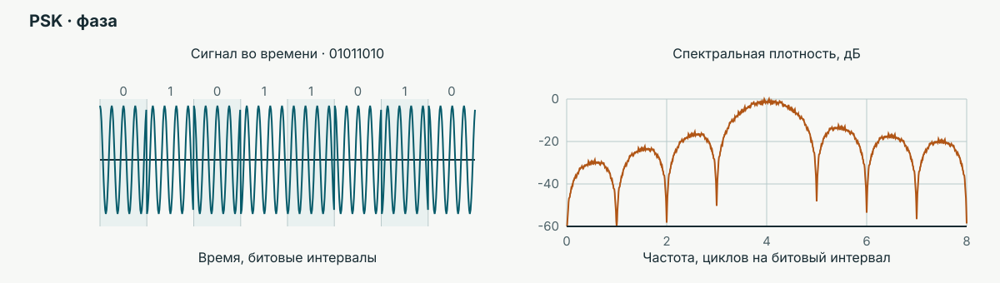
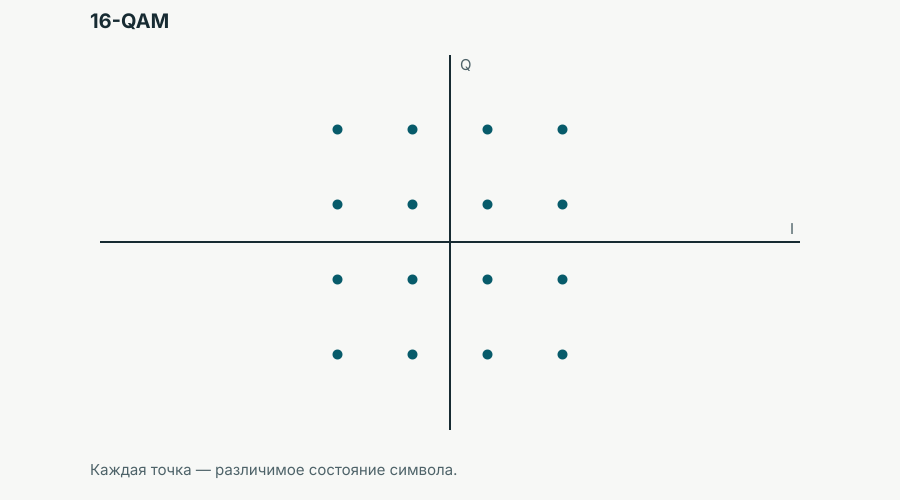
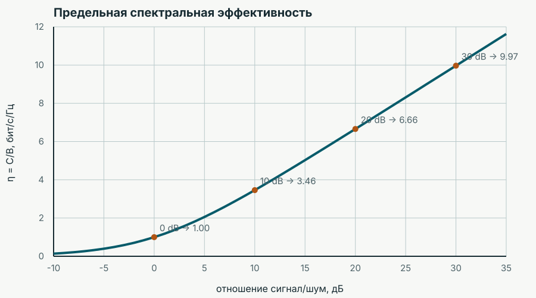
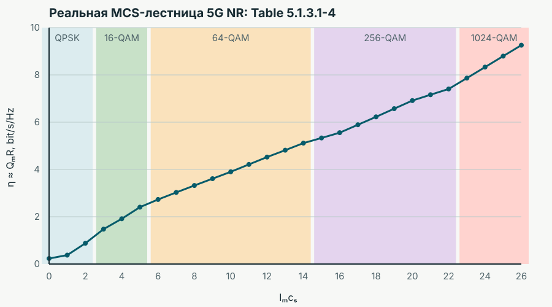
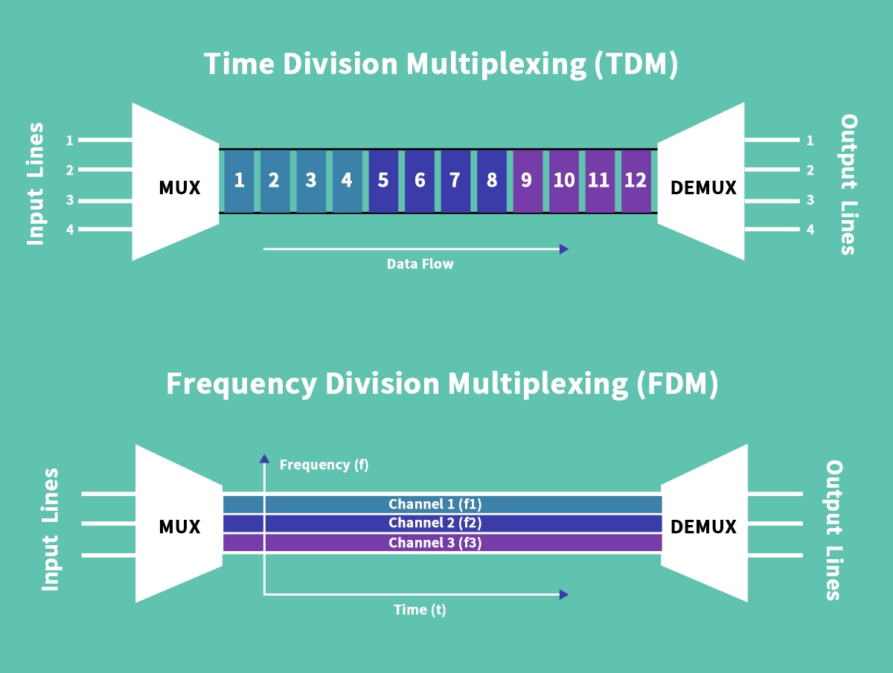

Смартфон передаёт данные по общему радиоканалу. Качество приёма и число активных пользователей меняются.

> От каких физических и организационных решений зависит скорость передачи данных одного пользователя?

## Как передать бит в полосе канала?

> Посмотрите на три способа передачи одной и той же последовательности битов. Что у несущей меняется между соседними битами?

**ASK** (*amplitude-shift keying*) — амплитудная манипуляция; **FSK** (*frequency-shift keying*) — частотная; **PSK** (*phase-shift keying*) — фазовая.

$T_b$ — длительность бита, $f_c$ — несущая частота.

::: {.keying-figures}

<picture class="keying-slide course-demo"><source media="(max-width: 760px)" srcset="../assets/lecture-04/keying-ask-mobile.svg"></picture>
<picture class="keying-slide course-demo"><source media="(max-width: 760px)" srcset="../assets/lecture-04/keying-fsk-mobile.svg"></picture>
<picture class="keying-slide course-demo"><source media="(max-width: 760px)" srcset="../assets/lecture-04/keying-psk-mobile.svg"></picture>

:::

### Как длительность бита влияет на спектр?

> Что произойдёт со спектром при сокращении $T_b$?

Модель использует прямоугольные битовые импульсы; ось частоты отсчитывается от несущей. Реальный спектр также зависит от формирования импульсов и фильтрации.

Как связаны полоса, битовая скорость и частота дискретизации?

**Длительность бита и полоса передачи.** Битовая скорость $R_b$ (бит/с) связана с длительностью бита:

$$R_b=\frac{1}{T_b}.$$

В показанной модели двоичных ASK и PSK прямоугольный импульс даёт первые нули спектральной огибающей на частотах $f_c\pm1/T_b$. Поэтому ширина главного лепестка между первыми нулями:

$$B_{\text{гл}}=\frac{2}{T_b}=2R_b.$$

При сокращении $T_b$ вдвое битовая скорость и ширина главного лепестка удваиваются. Это **не полная полоса спектра**: у прямоугольных импульсов есть боковые лепестки за первыми нулями. При FSK нужно также учитывать разнос двух частот; при другой форме импульсов связь полосы и скорости меняется.

**От исходного сигнала к потоку битов.** Для исходного сигнала с частотами от нуля до $B_{\text{ист}}$ условие дискретизации из темы 01 — $f_s>2B_{\text{ист}}$, где $f_s$ — частота дискретизации (отсчётов/с). Если один отсчёт кодируется $n$ битами, то для одного канала без сжатия, служебных и избыточных битов:

$$R_b=n f_s,\qquad T_b=\frac{1}{n f_s}.$$

Для передачи этого потока двоичными ASK или PSK с прямоугольными импульсами получаем $B_{\text{гл}}=2n f_s$. Таким образом, полоса **исходного сигнала** задаёт необходимую частоту дискретизации, разрядность — битовую скорость, а способ модуляции и форма импульсов — полосу **передаваемого сигнала**. Частота дискретизации не равна битовой скорости: каждый отсчёт содержит несколько битов.

Для самостоятельного изучения: [Analog Devices — MT-002, выбор частоты дискретизации](https://www.analog.com/media/en/training-seminars/tutorials/mt-002.pdf).

## Сколько бит несёт состояние сигнала?

**QPSK** (*quadrature phase-shift keying*) — квадратурная фазовая манипуляция; **QAM** (*quadrature amplitude modulation*) — квадратурная амплитудная модуляция. $I$ и $Q$ — синфазная и квадратурная координаты сигнала.

::: {.callout-note}
### Почему здесь комплексные числа?

Точка созвездия задаёт две реальные ортогональные составляющие сигнала — $I$ и $Q$. Запись $I+jQ$ объединяет их в один объект: расстояние до нуля задаёт амплитуду, угол — фазу. Тот же язык помогает описывать импеданс и частотные характеристики. Подробнее — [«Почему инженеры любят комплексные числа»](../reference/complex-numbers.qmd).
:::

  <figure><figcaption>QPSK · 2 бита на символ</figcaption></figure>
  <figure><figcaption>16-QAM · 4 бита на символ</figcaption></figure>
  <figure><figcaption>64-QAM · 6 бит на символ</figcaption></figure>

### Какие порядки модуляции применяют на практике?

> В созвездии стало в четыре раза больше точек. Во сколько раз выросло число бит на символ?

<figure class="modulation-roadmap course-demo" aria-label="Порядки модуляции и условия применения">

МодуляцияБит на символГде и при каких условиях применяют

<ul class="modulation-roadmap-steps">
  <li><strong>BPSK · 2 точки</strong><b>1</b><strong>Самые устойчивые режимы Wi-Fi</strong> При плохом канале: скорость снижают, чтобы сохранить связь</li>
  <li><strong>QPSK · 4 точки</strong><b>2</b><strong>Сотовая связь и Wi-Fi</strong> Данные при плохом канале; управляющая информация, например PDCCH в 5G</li>
  <li><strong>16-QAM</strong><b>4</b><strong>Передача данных в Wi-Fi, LTE и 5G</strong> Промежуточные режимы: канал уже позволяет повысить скорость относительно QPSK</li>
  <li><strong>64-QAM</strong><b>6</b><strong>Высокие скорости в Wi-Fi 4, LTE и 5G</strong> При хорошем канале; верхний порядок стандартных режимов Wi-Fi 4</li>
  <li><strong>256-QAM</strong><b>8</b><strong>Высокие скорости в Wi-Fi 5, LTE и 5G</strong> При очень хорошем канале; верхний порядок стандартных режимов Wi-Fi 5</li>
  <li><strong>1024-QAM · 1K</strong><b>10</b><strong>Топовые режимы бытовых устройств и 5G DL</strong> Wi-Fi 6/6E и 5G от базовой станции к устройству: при хорошем канале и поддержке обеих сторон</li>
  <li><strong>4096-QAM · 4K</strong><b>12</b><strong>Топовые режимы бытовых устройств</strong> Wi-Fi 7: очень хороший канал, обычно рядом с роутером</li>
  <li><strong>16384-QAM · 16K</strong><b>14</b><strong>Верхняя планка коммерческих РРЛ</strong> В особо хороших условиях. Например, Trango PXG2-AIR: выше 16K-QAM не поддерживает</li>
</ul>
<figcaption>1K–4K — высокоскоростные режимы бытовой связи; 16K — предельный режим специализированной радиорелейной аппаратуры в приведённом примере.</figcaption>
</figure>

Условия применения и реальные спецификации

При двоичном маппинге $Q_m=\log_2 M$: 1K, 4K и 16K здесь означают 1024, 4096 и 16384 точки. Число бит относится к одному символу модуляции, до учёта кодирования и служебных затрат.

Условия на карте — качественные ориентиры при сопоставимой средней мощности, символьной скорости и требованиях к ошибкам. Универсальных порогов в дБ для каждого порядка нет: они зависят от кодирования, приёмника и характера искажений. BPSK и QPSK при одинаковой энергии на бит в идеальном шумовом канале имеют одинаковую вероятность битовой ошибки; один порядок модуляции ещё не определяет надёжность.

Один радиоинтерфейс использует разные модуляции для разных физических каналов. В 5G NR **PDCCH** (*Physical Downlink Control Channel*) передаёт управляющую информацию от базовой станции с QPSK. **PUSCH** (*Physical Uplink Shared Channel*) передаёт данные от устройства; при DFT-s-OFDM (с преобразованием Фурье перед OFDM) для него предусмотрена и **π/2-BPSK**. Она несёт один бит на символ: ориентация пары возможных состояний поворачивается на 90° между соседними символами. Поэтому набор точек всей последовательности нельзя считать обычным четырёхточечным созвездием с двумя битами на символ.

Высокие порядки требуют большого SNR и малых искажений. Их применение зависит от качества канала и возможностей обоих устройств. В 5G и Wi-Fi режим может меняться; в радиорелейной линии (РРЛ) между направленными антеннами при ухудшении условий адаптивная модуляция также позволяет перейти на меньший порядок. Наличие 16K-QAM в спецификации не означает постоянную работу в этом режиме.

16K-QAM — верхний поддерживаемый порядок для приведённой коммерческой РРЛ Trango PXG2-AIR. Это предел конкретной аппаратуры; утверждение, что любое коммерческое устройство в любой технологии ограничено 16K-QAM, из этой спецификации не следует.

Документация для самостоятельного изучения:

- [3GPP TS 38.211 — модуляция физических каналов 5G NR](https://www.etsi.org/deliver/etsi_ts/138200_138299/138211/17.04.00_60/ts_138211v170400p.pdf): таблица 6.3.1.2-1 — π/2-BPSK для PUSCH; §7.3.2.4 — QPSK для PDCCH.
- [5G NR — таблица MCS стандарта 3GPP](#nr-mcs-source): порядки от QPSK до 1024-QAM и кодовые скорости.
- [Qualcomm — Wi-Fi 7 Quick Reference Guide, с. 6](https://www.qualcomm.com/content/dam/qcomm-martech/dm-assets/documents/Qualcomm-Wi-Fi-7-Reference-Guide.pdf#page=6): раздел о 4K-QAM и сравнении с 1K-QAM в Wi-Fi 6/6E.
- [Trango — PXG2-AIR, предварительная спецификация DS-0008 r1, с. 3](https://gotrango.com/wp-content/uploads/2024/03/DS-0008-r1-PGX2-AIR.pdf#page=3): строка Modulation Levels — от QPSK до 16384-QAM, с адаптивной модуляцией (ACM).

### Как отобразить биты в символы

**Маппинг** (*mapping*) — правило, по которому группа битов выбирает символ модуляции, то есть определённую точку созвездия. Передатчик по этому правилу преобразует биты в координаты $I$ и $Q$, а приёмник выполняет обратное преобразование — **демаппинг**. Чтобы восстановить данные, обе стороны должны использовать согласованное соответствие между битами и точками.

#### Код Грея

<figure class="gray-code-figure course-demo" tabindex="0" aria-label="Созвездие с метками Грея; на узком экране доступна прокрутка">
<svg class="gray-code-strip" viewBox="0 0 700 550" role="img" aria-label="Полное созвездие 16-QAM с четырёхбитными метками Грея. Соседние точки 01|01 и 11|01 отличаются одним битом">
  <title>Код Грея на всех шестнадцати точках 16-QAM</title>
  <rect width="700" height="550" fill="var(--surface)"/>
  <text x="105" y="35" class="gray-code-muted">Метка точки: I | Q</text>
  <path d="M160 85 V460 M285 85 V460 M410 85 V460 M535 85 V460 M160 85 H535 M160 210 H535 M160 335 H535 M160 460 H535" fill="none" stroke="var(--line)" stroke-width="1" stroke-dasharray="4 5"/>
  <line x1="70" y1="272.5" x2="630" y2="272.5" class="gray-code-axis"/>
  <path d="M630 272.5 l-10 -5 v10 z" class="gray-code-axis-arrow"/>
  <line x1="347.5" y1="510" x2="347.5" y2="47" class="gray-code-axis"/>
  <path d="M347.5 47 l-5 10 h10 z" class="gray-code-axis-arrow"/>
  <text x="647" y="277" class="gray-code-muted">I</text>
  <text x="359" y="42" class="gray-code-muted">Q</text>
  <text x="337" y="292" text-anchor="end" class="gray-code-muted">0</text>
  <text x="160" y="260" text-anchor="middle" class="gray-code-muted">−3</text>
  <text x="285" y="260" text-anchor="middle" class="gray-code-muted">−1</text>
  <text x="410" y="260" text-anchor="middle" class="gray-code-muted">+1</text>
  <text x="535" y="260" text-anchor="middle" class="gray-code-muted">+3</text>
  <text x="359" y="101" class="gray-code-muted">+3</text>
  <text x="359" y="226" class="gray-code-muted">+1</text>
  <text x="359" y="351" class="gray-code-muted">−1</text>
  <text x="359" y="476" class="gray-code-muted">−3</text>
  <line x1="285" y1="335" x2="410" y2="335" class="gray-code-highlight"/>
  <text x="160" y="64" text-anchor="middle">00|10</text><circle cx="160" cy="85" r="5"/>
  <text x="285" y="64" text-anchor="middle">01|10</text><circle cx="285" cy="85" r="5"/>
  <text x="410" y="64" text-anchor="middle">11|10</text><circle cx="410" cy="85" r="5"/>
  <text x="535" y="64" text-anchor="middle">10|10</text><circle cx="535" cy="85" r="5"/>
  <text x="160" y="189" text-anchor="middle">00|11</text><circle cx="160" cy="210" r="5"/>
  <text x="285" y="189" text-anchor="middle">01|11</text><circle cx="285" cy="210" r="5"/>
  <text x="410" y="189" text-anchor="middle">11|11</text><circle cx="410" cy="210" r="5"/>
  <text x="535" y="189" text-anchor="middle">10|11</text><circle cx="535" cy="210" r="5"/>
  <text x="160" y="314" text-anchor="middle">00|01</text><circle cx="160" cy="335" r="5"/>
  <text x="285" y="314" text-anchor="middle" class="gray-code-emphasis">01|01</text><circle cx="285" cy="335" r="7" class="gray-code-emphasis-point"/>
  <text x="410" y="314" text-anchor="middle" class="gray-code-emphasis">11|01</text><circle cx="410" cy="335" r="7" class="gray-code-emphasis-point"/>
  <text x="535" y="314" text-anchor="middle">10|01</text><circle cx="535" cy="335" r="5"/>
  <text x="160" y="439" text-anchor="middle">00|00</text><circle cx="160" cy="460" r="5"/>
  <text x="285" y="439" text-anchor="middle">01|00</text><circle cx="285" cy="460" r="5"/>
  <text x="410" y="439" text-anchor="middle">11|00</text><circle cx="410" cy="460" r="5"/>
  <text x="535" y="439" text-anchor="middle">10|00</text><circle cx="535" cy="460" r="5"/>
</svg>
<figcaption>Выделенные соседи <code>01|01</code> и <code>11|01</code> различаются одним битом.</figcaption>
</figure>

Код Грея **не добавляет избыточных битов и не меняет расстояния между точками**: при той же геометрии вероятность ошибки символа остаётся прежней, но ошибка в ближайшую точку обычно портит меньше битов.

> Сколько бит могут измениться, если приёмник вместо ближайшей точки по одной оси выберет диагонального соседа?

> Как число состояний $M$ связано с числом бит на символ $Q_m$? Что случится с расстоянием между соседними точками при увеличении $M$ и той же средней мощности?

## Как оценить качество канала?

**SNR** (*signal-to-noise ratio*) — отношение мощности сигнала к мощности шума; **дБ** — децибел.

$$\mathrm{SNR}=\frac{P_s}{P_n},\qquad \mathrm{SNR}_{\mathrm{дБ}}=10\log_{10}\frac{P_s}{P_n}.$$

**Спектральная эффективность** $\eta=R/B$ — скорость передачи $R$ (бит/с) на единицу полосы канала $B$ (Гц). Для канала с аддитивным белым гауссовским шумом предел Шеннона:

$$\eta\leq\frac{C}{B}=\log_2(1+\mathrm{SNR}),$$

где $C$ — предельная скорость канала (бит/с), а SNR в формуле берётся как отношение мощностей, не в децибелах.

#### Больше бит на символ?

> При фиксированном шуме сравните QPSK и 64-QAM. Почему выбор с большим числом бит на символ может оказаться неудачным?

#### Что меняется при снижении SNR?

> Как изменится различимость состояний при снижении SNR? Что ограничивает предел Шеннона и почему он не равен скорости конкретного пользователя?

Различимость состояний

## Что делать с ошибками?

**SER** (*symbol error rate*) — доля ошибочно распознанных символов: приёмник выбрал другую точку созвездия. **BER** (*bit error rate*) — доля ошибочных битов; **BLER** (*block error rate*) — доля блоков с ошибкой.

::: {.column-page .error-rate-formulas}
$$\mathrm{SER}=\frac{N_{\text{ошибочных символов}}}{N_{\text{переданных символов}}}$$

$$\mathrm{BER}=\frac{N_{\text{ошибочных битов}}}{N_{\text{переданных битов}}}$$

$$\mathrm{BLER}=\frac{N_{\text{блоков с ошибкой}}}{N_{\text{переданных блоков}}}$$
:::

## Как мы можем контролировать ошибки?

### Контрольный бит: проверка чётности

**Бит чётности** $p$ выбирают так, чтобы число единиц в данных вместе с контрольным битом было чётным. $\oplus$ — сложение по модулю 2 (XOR): $1\oplus1=0$, $1\oplus0=1$.

$$p=b_1\oplus b_2\oplus b_3\oplus b_4.$$

$$p=1\oplus0\oplus1\oplus1=1.$$

<svg class="control-schematic parity-circuit" viewBox="0 0 500 270" role="img" aria-labelledby="xor-title">
<title id="xor-title">Формирование бита чётности четырёх информационных битов тремя двухвходовыми XOR-элементами</title>
<g class="logic-gate"><rect x="105" y="35" width="65" height="65"/><rect x="105" y="170" width="65" height="65"/><rect x="295" y="103" width="65" height="65"/></g>
<g class="diagram-wire"><path d="M45 51 H105 M45 84 H105 M45 186 H105 M45 219 H105 M170 68 H230 V120 H295 M170 203 H230 V151 H295 M360 135 H447"/></g>
<g class="gate-label"><text x="137" y="78">=1</text><text x="137" y="213">=1</text><text x="327" y="146">=1</text></g>
<text x="12" y="59">b₁</text><text x="12" y="92">b₂</text><text x="12" y="194">b₃</text><text x="12" y="227">b₄</text><text x="461" y="143">p</text>
<text x="250" y="264" text-anchor="middle" class="diagram-muted">=1 — двухвходовой XOR</text>
</svg>

<svg class="control-schematic parity-schematic" viewBox="0 0 430 245" role="img" aria-labelledby="parity-title parity-desc">
<title id="parity-title">Проверка чётности: один бит изменился в канале</title>
<desc id="parity-desc">Данные 1011 и контрольный бит 1 дают четыре единицы. После изменения третьего бита приняты данные 1001 и тот же контрольный бит 1: три единицы, ошибка обнаружена.</desc>
<text x="222" y="23" text-anchor="middle" class="diagram-muted">данные</text><text x="391" y="23" text-anchor="middle" class="diagram-muted">p</text>
<text x="12" y="73" class="diagram-caption">Передано</text>
<g class="bit-cell"><rect x="118" y="43" width="44" height="44" rx="5"/><rect x="174" y="43" width="44" height="44" rx="5"/><rect x="230" y="43" width="44" height="44" rx="5"/><rect x="286" y="43" width="44" height="44" rx="5"/></g>
<rect x="369" y="43" width="44" height="44" rx="5" class="parity-cell"/>
<g class="bit-value"><text x="140" y="73">1</text><text x="196" y="73">0</text><text x="252" y="73">1</text><text x="308" y="73">1</text><text x="391" y="73">1</text></g>
<path d="M252 95 V139 m-5 -8 5 8 5 -8" class="error-arrow"/><text x="270" y="121" class="diagram-error">1 → 0</text>
<text x="12" y="182" class="diagram-caption">Принято</text>
<g class="bit-cell"><rect x="118" y="152" width="44" height="44" rx="5"/><rect x="174" y="152" width="44" height="44" rx="5"/><rect x="286" y="152" width="44" height="44" rx="5"/></g>
<rect x="230" y="152" width="44" height="44" rx="5" class="error-cell"/><rect x="369" y="152" width="44" height="44" rx="5" class="parity-cell"/>
<g class="bit-value"><text x="140" y="182">1</text><text x="196" y="182">0</text><text x="252" y="182" class="diagram-error">0</text><text x="308" y="182">1</text><text x="391" y="182">1</text></g>
<text x="265" y="231" text-anchor="middle" class="diagram-caption">Чётность нарушена: s = 1</text>
</svg>

Проверка на приёмнике:

$$s=b'_1\oplus b'_2\oplus b'_3\oplus b'_4\oplus p'.$$

$$s=1\oplus0\oplus0\oplus1\oplus1=1.$$

$s=0$ — проверка пройдена; $s=1$ — правило чётности нарушено.

> Можно ли по результату проверки узнать, какой бит изменился? Что произойдёт, если изменятся два бита?

Граница проверки чётности

Проверка обнаруживает нечётное число изменившихся битов, но не указывает место ошибки. Чётное число изменений сохраняет чётность и остаётся незамеченным.

### CRC: контрольные биты блока

**CRC** (*cyclic redundancy check*) — циклический избыточный код для обнаружения ошибок. Передатчик вычисляет контрольные биты по данным и добавляет их к блоку.

<svg class="control-schematic coded-frame crc-frame" viewBox="0 0 560 180" role="img" aria-labelledby="crc-frame-title crc-frame-desc">
<title id="crc-frame-title">Передаваемый блок: данные и CRC</title>
<desc id="crc-frame-desc">Один блок из двух полей. Верхняя строка: DATA и CRC. Нижняя строка: биты данных 1011 и контрольные биты 100.</desc>
<rect x="20" y="20" width="320" height="140" class="frame-data"/>
<rect x="340" y="20" width="200" height="140" class="frame-crc"/>
<rect x="20" y="20" width="520" height="140" class="frame-outline"/>
<path d="M340 20 V160 M20 78 H540" class="frame-divider"/>
<text x="180" y="57" class="frame-heading">DATA</text>
<text x="440" y="57" class="frame-heading">CRC</text>
<text x="180" y="132" class="frame-bits">1011</text>
<text x="440" y="132" class="frame-bits">100</text>
</svg>

Приёмник проверяет данные по CRC. Несовпадение указывает на ошибку; сама CRC не исправляет данные и может не обнаружить некоторые искажения.

## Как мы можем исправить ошибки?

**Помехоустойчивое кодирование FEC** (*forward error correction*) добавляет избыточность для исправления ошибок на приёмнике. Простой пример — повторение: один информационный бит кодируется тремя одинаковыми битами. В канале один из них изменился.

<svg class="control-schematic coded-frame repetition-frame" viewBox="0 0 600 180" role="img" aria-labelledby="repetition-title repetition-desc">
<title id="repetition-title">Кодирование повторением и ошибка в канале</title>
<desc id="repetition-desc">Информационный бит 0 кодируется в слово 000. Приёмник получает 010: средний бит ошибочен и выделен цветом.</desc>
<rect x="20" y="20" width="120" height="140" class="frame-data"/>
<rect x="140" y="20" width="220" height="140" class="frame-crc"/>
<rect x="360" y="20" width="220" height="140" class="frame-data"/>
<rect x="20" y="20" width="560" height="140" class="frame-outline"/>
<path d="M140 20 V160 M360 20 V160 M20 78 H580" class="frame-divider"/>
<text x="80" y="57" class="frame-heading">Бит</text>
<text x="250" y="57" class="frame-heading">Кодовое слово</text>
<text x="470" y="57" class="frame-heading">Принято</text>
<text x="80" y="132" class="frame-bits">0</text>
<text x="250" y="132" class="frame-bits">000</text>
<rect x="451" y="91" width="38" height="54" rx="4" class="error-cell"/>
<text x="434" y="132" class="frame-bits">0</text>
<text x="470" y="132" class="frame-bits diagram-error">1</text>
<text x="506" y="132" class="frame-bits">0</text>
</svg>

> Как приёмнику одновременно получить три бита, если они приходят по очереди?

Что означает задержка z⁻¹?

Блок $z^{-1}$ запоминает входной бит и выдаёт его через **один битовый интервал** $T_b$. Поэтому на его выходе находится предыдущий бит, а после двух таких блоков — бит, пришедший два интервала назад. Соединённые последовательно блоки задержки образуют **сдвиговый регистр**: при поступлении нового бита сохранённые значения продвигаются на одну позицию. Для чтения этой схемы не нужно знать устройство триггеров или z-преобразование.

Обозначение $r[n]$ означает текущий принятый бит, $r[n-1]$ — предыдущий, $r[n-2]$ — ещё на один интервал старше. Квадратные скобки здесь нумеруют битовые интервалы.

<figure class="course-demo repetition-circuit">

<svg class="control-schematic" viewBox="0 0 900 370" role="img" aria-labelledby="repetition-decoder-title repetition-decoder-desc">
<title id="repetition-decoder-title">Приём слова 010: текущий бит и два сохранённых бита</title>
<desc id="repetition-decoder-desc">Показан момент прихода третьего бита слова 010. Сейчас принят 0; после первой задержки доступен предыдущий бит 1, после второй — первый бит 0. Все три значения поступают в блок решения большинством, который выдаёт 0.</desc>
<text x="240" y="35" text-anchor="middle">Сейчас</text><text x="470" y="35" text-anchor="middle">1 интервал назад</text><text x="690" y="35" text-anchor="middle">2 интервала назад</text>
<g class="gate-label"><text x="240" y="82">0</text><text x="470" y="82" class="diagram-error">1</text><text x="690" y="82">0</text></g>
<g class="logic-gate"><rect x="290" y="110" width="120" height="90"/><rect x="520" y="110" width="120" height="90"/><rect x="360" y="265" width="260" height="70"/></g>
<g class="diagram-wire"><path d="M155 155 H290 M410 155 H520 M640 155 H750 M240 155 V300 H360 M470 155 V265 M690 155 V300 H620 M620 315 H805"/></g>
<g class="junction"><circle cx="240" cy="155" r="4"/><circle cx="470" cy="155" r="4"/><circle cx="690" cy="155" r="4"/></g>
<text x="350" y="146" text-anchor="middle">z<tspan dy="-9" font-size="16">−1</tspan></text><text x="580" y="146" text-anchor="middle">z<tspan dy="-9" font-size="16">−1</tspan></text>
<text x="350" y="180" text-anchor="middle" class="pin-label">1 интервал</text><text x="580" y="180" text-anchor="middle" class="pin-label">1 интервал</text>
<text x="25" y="145">Принятые</text><text x="25" y="175">биты</text>
<text x="490" y="309" text-anchor="middle">Решение большинством</text><text x="820" y="323" class="diagram-emphasis">0</text>
</svg>

<figcaption>Момент прихода третьего бита слова 010. На отводах одновременно доступны текущий бит и два предыдущих. Решение принимается после каждой полной тройки; границы кодовых слов должны быть известны приёмнику. Линии показывают движение битов, точки — отводы к блоку решения.</figcaption>
</figure>

Как биты продвигаются через задержки

| Пришёл бит | Сейчас | После первого z⁻¹ | После второго z⁻¹ |
|:--|:--:|:--:|:--:|
| Первый | 0 | — | — |
| Второй | 1 | 0 | — |
| Третий | 0 | 1 | 0 |

Знак «—» означает, что в этой позиции ещё нет бита текущего кодового слова. После третьего бита собрана вся тройка. Сам блок задержки не повторяет бит и не исправляет ошибку: он сохраняет предыдущие значения для совместного сравнения.

Формула решения большинством и таблица истинности

$\land$ — логическое И: обе величины равны единице. $\lor$ — логическое ИЛИ: хотя бы одна величина равна единице. $\widehat b$ — восстановленный информационный бит.

$$\widehat b=(b'_1\land b'_2)\lor(b'_1\land b'_3)\lor(b'_2\land b'_3).$$

| $b'_1$ | $b'_2$ | $b'_3$ | $\widehat b$ |
|:--:|:--:|:--:|:--:|
| 0 | 0 | 0 | 0 |
| 0 | 0 | 1 | 0 |
| 0 | 1 | 0 | 0 |
| 0 | 1 | 1 | 1 |
| 1 | 0 | 0 | 0 |
| 1 | 0 | 1 | 1 |
| 1 | 1 | 0 | 1 |
| 1 | 1 | 1 | 1 |

Кодовая скорость:

$$R_c=\frac{k}{n}.$$

$k$ — число информационных битов; $n$ — число переданных кодовых битов.

Для кода с избыточностью $R_c<1$.

В примере $k=1$, $n=3$, $R_c=1/3$.

### Ошибки при разном качестве канала

> Какова плата за помехоустойчивость?

Обозначения модели

**LDPC** (*low-density parity-check*) — код с разреженной проверочной матрицей. **AWGN** (*additive white Gaussian noise*) — аддитивный белый гауссовский шум. BER кодированных режимов измеряется для информационных битов после декодирования.

[Данные с LDPC](../data/lecture-04/nr-ber-awgn.csv) · [данные без кодирования](../data/lecture-04/uncoded-ber-awgn.csv).

Кодирование и ошибки

## Как меняется режим передачи?

**MCS** (*modulation and coding scheme*) — сочетание порядка модуляции и кодовой скорости. **NR** (*New Radio*) — радиоинтерфейс сетей пятого поколения (5G). **Адаптивная модуляция и кодирование (AMC)** — выбор режима по состоянию канала.

::: {#nr-mcs-source}
Источник таблицы MCS: [ETSI TS 138 214 V17.1.0 / 3GPP TS 38.214, таблица 5.1.3.1-4](https://www.etsi.org/deliver/etsi_ts/138200_138299/138214/17.01.00_60/ts_138214v170100p.pdf).
:::

## Если потоков несколько

`Потоки → объединение → общий канал → разделение → потоки`

**Мультиплексирование** — совместное использование канала несколькими потоками.

> Как можно объединить данные нескольких пользователей для передачи по общему каналу?

  <figure class="multiplex-figure course-demo" tabindex="0">
    
    <figcaption>Временное и частотное мультиплексирование. Изображение: <a href="https://resources.l-p.com/glossary/tdm-time-division-multiplexing-basics-uses-benefits-guide">LINK-PP</a>.</figcaption>
  </figure>
  <figure class="multiplex-figure fdm-ofdm-container course-demo">



<figcaption>FDM и OFDM при одинаковом масштабе частоты. Показаны основные лепестки спектров; сравнение полосы схематическое. В OFDM шаг поднесущих равен 1/T, где T — длительность полезной части символа.</figcaption>
  </figure>

## Кому достанется общий ресурс?

**Множественный доступ** — назначение ресурса независимым пользователям.



## Как оценить скорость передачи пользователя?

Для оценки до служебных затрат и повторов:

$$R_u\approx R_s\,\rho_u\,Q_m\,R_c.$$

$R_u$ — скорость передачи информационных битов пользователя; $R_s$ — символьная скорость; $\rho_u$ — доля общего ресурса пользователя; $Q_m$ — бит на символ; $R_c$ — кодовая скорость.

Если $T_b$ — длительность одного кодового бита, то символ длится $Q_mT_b$, а символьная скорость равна:

$$R_s=\frac{1}{Q_mT_b}.$$

Поэтому ту же скорость передачи можно записать через $T_b$:

$$R_u\approx\frac{\rho_uR_c}{T_b}.$$

> Пользователь удаляется от базовой станции, а число активных пользователей растёт. Какие множители формулы могут измениться? Где в рассуждении нужны SNR, планировщик ресурса и множественный доступ?

::: {.callout-note icon=false appearance="simple"}
## 🚀 Что дальше?



Мы рассмотрели способы представления битов и совместного использования ресурса. Но между передатчиком и приёмником находится реальная среда. Как затухание, многолучёвость и изменение канала влияют на переданный сигнал?

[Следующая тема: Среда распространения и искажения →](channel-playground.qmd)

:::

