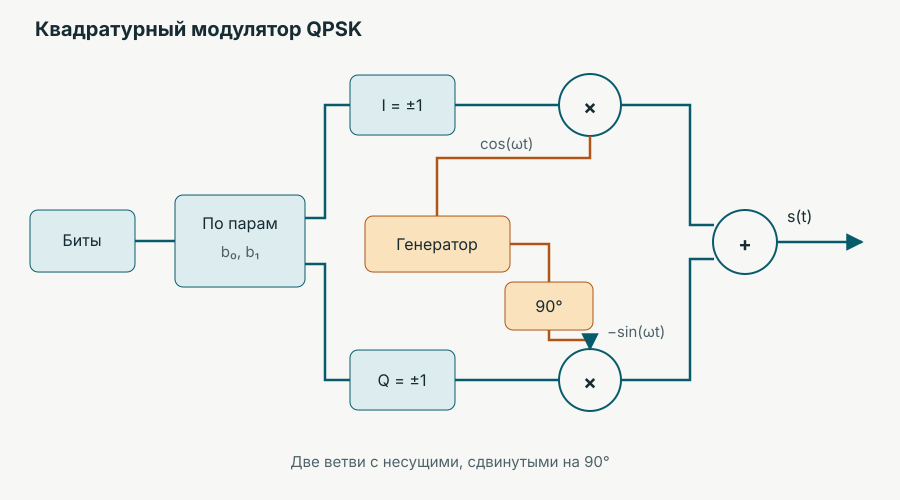

`011010011…` → физический сигнал → приёмник. Полоса, мощность и время ограничены; в канале есть шум.

> Как передать больше полезных битов, когда этот канал нужен сразу нескольким людям?

## Один поток: как сигнал переносит биты?

Передатчик выбирает одно из $M$ различимых состояний сигнала. Один такой выбор — **символ**.

$$Q_m=\log_2 M\quad\text{бит/символ}.$$

| Состояний $M$ | 2 | 4 | 16 |
|:--|--:|--:|--:|
| Бит на символ $Q_m$ | 1 | 2 | 4 |

### Чем могут различаться состояния?

Осциллограммы для `01011010`; спектры усреднены по длинной последовательности:

Для $b\in\{0,1\}$ в пределах одного битового интервала $0\leq t<T_b$:

$$\begin{aligned}
\mathrm{ASK}:\quad&s_b(t)=A_b\cos(2\pi f_c t),&&A_0=0,\ A_1=A;\\
\mathrm{FSK}:\quad&s_b(t)=A\cos(2\pi f_b t+\varphi_0),&&f_0\ne f_1;\\
\mathrm{PSK}:\quad&s_b(t)=A\cos(2\pi f_c t+\varphi_b),&&\varphi_0=0,\ \varphi_1=\pi.
\end{aligned}$$

> Что меняется в каждом случае: амплитуда, частота или фаза?

### Больше состояний в том же диапазоне

**QPSK**: четыре фазовых состояния. **QAM**: состояния различаются двумя координатами сигнала.

$$I,Q\in\{-1,+1\},\qquad s(t)=\frac{A}{\sqrt2}\bigl[I\cos(2\pi f_ct)-Q\sin(2\pi f_ct)\bigr].$$

Каждая пара бит задаёт $I$ и $Q$; два слагаемых используют несущие со сдвигом фазы $90^\circ$.

| QPSK · 2 бита | 16-QAM · 4 бита | 64-QAM · 6 бит |
|:--:|:--:|:--:|
|  |  |  |

> Если мощность ограничена, почему нельзя всегда выбирать самое густое созвездие?

Точки сближаются: при том же шуме приёмнику труднее их различать.

**Опыт:** сохраните SNR и сравните QPSK с 64-QAM. Меняются и число бит на символ, и число ошибок.

### Насколько большим бывает $M$?

| Модуляция | Бит/символ |
|:--|--:|
| QPSK | 2 |
| 16-QAM | 4 |
| 64-QAM | 6 |
| 256-QAM | 8 |
| 1024-QAM | 10 |
| 4096-QAM | 12 |
| 8192-QAM | 13 |
| 16384-QAM† | 14 |

† 16384-QAM — крайний специализированный случай, а не обычный режим Wi‑Fi или 5G. [Wi‑Fi 7 поддерживает 4096-QAM](https://www.qualcomm.com/wi-fi/wi-fi-7); [дополнительная таблица 5G NR содержит 1024-QAM](https://www.etsi.org/deliver/etsi_ts/138200_138299/138214/18.09.00_60/ts_138214v180900p.pdf); [радиорелейное оборудование с 8192-QAM](https://www.huawei.com/en/news/2017/10/Huawei-5G-Microwave-Bearer-Solution).

`4096-QAM → 8192-QAM`: число состояний удвоилось, прибавился всего **один бит на символ**.

### Предел, с которым полезно сравнивать

$$\eta_{\mathrm{предел}}=\frac{C}{B}=\log_2(1+\mathrm{SNR}),$$

где отношение сигнал/шум (SNR) в формуле — отношение мощностей, а на графике — децибелы. При достаточно большом SNR прибавка около 3 дБ даёт примерно ещё 1 бит/с/Гц. Это теоретический ориентир, а не скорость конкретной сети.

## Появились другие пользователи

`Алиса: 011010…`　`Боб: 110001…`

> Как разделить общий канал?

| Частота | Время | Время × частота |
|:--|:--|:--|
| Разные полосы одновременно — **FDMA** | Одна полоса по очереди — **TDMA** | Разные клетки общей сетки — **OFDMA** |

**Опыт:** у Димы нет данных. Сравните заранее выделенные равные доли с распределением по текущей потребности. Каждая клетка достаётся только одному пользователю.

Устройство, выбирающее получателя ресурса, — **планировщик**. Оно учитывает очередь данных и состояние канала.

## Алиса и Боб слышат канал по-разному

`Алиса: высокий SNR`　`Боб: низкий SNR`

> Стоит ли им назначить одну и ту же модуляцию?

При ухудшении канала можно уменьшить $Q_m$. Тогда один символ несёт меньше битов, зато состояния легче различить. Система меняет режим передачи по состоянию канала — **адаптация линии**.

### Как справиться с оставшимися ошибками?

`0 → 000`　`1 → 111` — простая идея повторения. Один испорченный бит можно восстановить большинством голосов, но пришлось передать втрое больше битов.

$$k\ \text{информационных бит}\ \longrightarrow\ \boxed{\text{помехоустойчивое кодирование}}\ \longrightarrow\ n\ \text{переданных бит},\qquad R_c=\frac{k}{n}.$$

$R_c$ — **кодовая скорость**. Меньшее значение оставляет больше места для избыточности. Реальные системы используют, например, коды LDPC и Polar.

**Вопрос:** сравните QPSK с $R_c=1/2$ и без кодирования при BER около $10^{-3}$. Сколько дБ выигрываем в этой модели?

<small>SNR здесь относится к переданному символу: с кодированием для тех же данных требуется больше символов. Канал — белый гауссовский шум; это локальный опыт MATLAB/5G Toolbox, не пороги MCS или прогноз для сети. Данные: [с LDPC](../data/lecture-04/nr-ber-awgn.csv) · [без кода](../data/lecture-04/uncoded-ber-awgn.csv). Методика: [LDPC](https://github.com/temasw/intro-to-networking/blob/main/scripts/lecture-04/generate_nr_ber.m) · [без кода](https://github.com/temasw/intro-to-networking/blob/main/scripts/lecture-04/generate_uncoded_ber.m).</small>

## Реальная система выбирает готовые сочетания

**MCS** — сочетание модуляции и кодовой скорости. Пример: таблица 5.1.3.1-4 для нисходящего канала 5G NR.

| Индекс $I_{\mathrm{MCS}}$ | $Q_m$ | $R_c$ | $\eta\approx Q_mR_c$ |
|--:|--:|--:|--:|
| 0 | 2 | 120/1024 | 0,2344 |
| 6 | 6 | 466/1024 | 2,7305 |
| 14 | 6 | 873/1024 | 5,1152 |
| 15 | 8 | 682,5/1024 | 5,3320 |
| 23 | 10 | 805,5/1024 | 7,8662 |
| 26 | 10 | 948/1024 | 9,2578 |

В стандарте кодовая скорость записана как $R_c\times1024$. При переходе **14 → 15** порядок модуляции растёт, а кодовая скорость снижается.

График Шеннона отвечает на вопрос «каков предел при данном SNR?». График MCS показывает доступные дискретные режимы. Универсальных порогов SNR для каждого индекса MCS таблица не задаёт.

## Три решения в одной строке

$$R_u\approx R_s\,\rho_u\,Q_m\,R_c,$$

где $R_s$ — символьная скорость, $\rho_u$ — доля ресурса пользователя, $Q_m$ — бит на символ, $R_c$ — кодовая скорость.

При $R_s=20$ млн символов/с, $\rho_u=1/4$, 16-QAM и $R_c=3/4$:

$$R_u\approx20\cdot\frac14\cdot4\cdot\frac34=15\ \text{Мбит/с}.$$

Это оценка: служебные сигналы, защитные интервалы и повторные передачи снизят реальную скорость.

> Алиса смотрит видео и уходит дальше от базовой станции. SNR падает; одновременно появляются ещё 20 пользователей. Как менять $\rho_u$, $Q_m$ и $R_c$? Кому придётся уступить ресурс?

Источник чисел MCS

[ETSI TS 138 214 V18.9.0, таблица 5.1.3.1-4, стр. 39](https://www.etsi.org/deliver/etsi_ts/138200_138299/138214/18.09.00_60/ts_138214v180900p.pdf). [Данные таблицы](../data/lecture-04/nr-mcs-table-4.csv).

