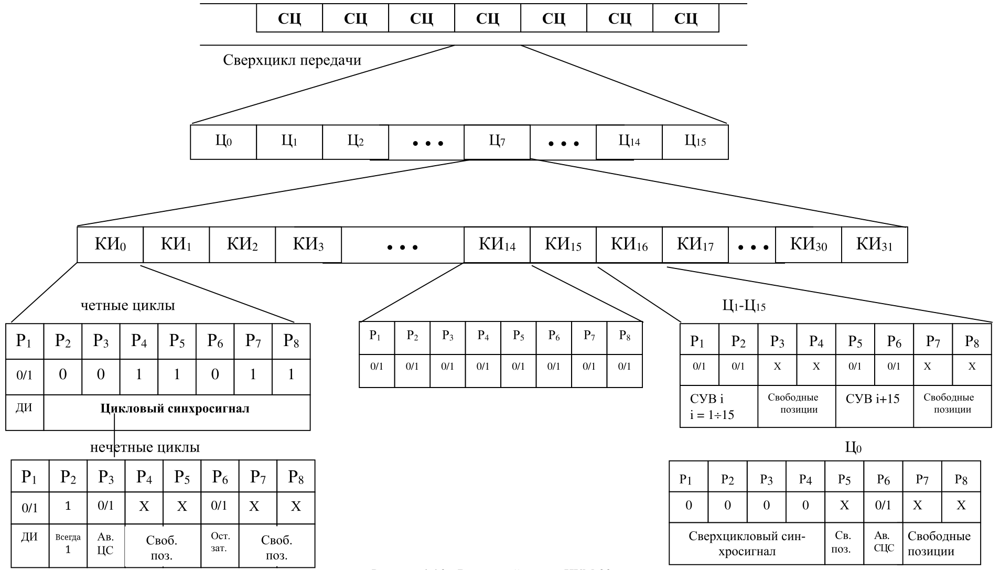

В [теме о физическом ресурсе](04-physical-resource.qmd) мы делили его между пользователями. Здесь два отдельных примера: сначала приёмник ИКМ, затем телефон в 5G.

> Достаточно ли увидеть сигнал, чтобы получить данные? Достаточно ли знать частоту, чтобы начать передавать?

Что означает «договориться»

У участников должна появиться достаточная **согласованность**: одинаковые правила интерпретации сигнала, нужные параметры и допустимый порядок использования ресурса. Слово «договориться» обозначает эту инженерскую задачу, а не объясняет её.

Часть правил задана заранее. Часть параметров приёмник восстанавливает по сигналу без запроса передатчику. Другие параметры сеть сообщает всем или назначает конкретному участнику. Обмен запросами и ответами — только один из механизмов.

Маршрут темы: **что известно заранее → что восстанавливается из сигнала → что сообщается всем → что согласуется индивидуально → что поддерживается во время работы**. Это зависимости между задачами; в реальной системе некоторые процессы совмещаются или повторяются.

## 1. ИКМ: восстановление структуры потока

### От сверхцикла к битам канального интервала

В тракте ИКМ-30 / E1 речевые слова передаются по очереди в 32 канальных интервалах (**КИ**) по 8 бит. Цикл длится 125 мкс; скорость — 2,048 Мбит/с. Здесь рассматривается вариант с поканальной сигнализацией: КИ 0 служебный, КИ 16 отведён сигнализации, остальные 30 — речи ([G.704, §2.3 и §5](https://www.itu.int/rec/T-REC-G.704-199810-I/en)).

> Где на общей схеме цикл, канальный интервал и отдельный бит? Какие позиции несут речь, а какие помогают разобрать поток?

::: {.column-page}
<figure class="pcm-overview">

<figcaption>А. В. Пуговкин, <a href="https://edu.tusur.ru/publications/9600">«Основы построения инфокоммуникационных систем и сетей»</a>, 2022, с. 65, рис. 4.46. Векторная схема: сверхцикл → цикл → КИ → разряды Р1–Р8. В развёртке КИ 0 исправлена позиция Р2 нечётных циклов: всегда 1 по G.704. ТЧ — телефонный канал; ДИ — дискретная информация; СУВ — сигналы управления и взаимодействия; Ав. ЦС / СЦС — авария цикловой / сверхцикловой синхронизации. Нажатие увеличивает рисунок. <a href="../assets/lecture-06/pcm-30-structure.svg" target="_blank" rel="noopener">Открыть SVG отдельно</a> — для дальнейшего увеличения средствами браузера.</figcaption>
</figure>
:::

### КИ 0: где начинается цикл?

> Какие биты приёмник может искать как известную комбинацию? Почему в соседнем цикле содержимое КИ 0 другое?

<svg class="pcm-bit-scheme" viewBox="0 0 820 420" role="img" aria-label="Развёртка КИ 0 по восьми битам в чётном и нечётном циклах"><text x="410" y="28" text-anchor="middle" class="scheme-title">КИ 0 · 8 бит · цикловая синхронизация</text><text x="50" y="55">Чётные циклы: Ц0, Ц2, …, Ц14</text><rect x="50" y="75" width="90" height="65"/><text x="95" y="95" text-anchor="middle" class="scheme-position">Бит 1</text><text x="95" y="124" text-anchor="middle" class="scheme-bit">Si</text><rect x="140" y="75" width="90" height="65"/><text x="185" y="95" text-anchor="middle" class="scheme-position">Бит 2</text><text x="185" y="124" text-anchor="middle" class="scheme-bit">0</text><rect x="230" y="75" width="90" height="65"/><text x="275" y="95" text-anchor="middle" class="scheme-position">Бит 3</text><text x="275" y="124" text-anchor="middle" class="scheme-bit">0</text><rect x="320" y="75" width="90" height="65"/><text x="365" y="95" text-anchor="middle" class="scheme-position">Бит 4</text><text x="365" y="124" text-anchor="middle" class="scheme-bit">1</text><rect x="410" y="75" width="90" height="65"/><text x="455" y="95" text-anchor="middle" class="scheme-position">Бит 5</text><text x="455" y="124" text-anchor="middle" class="scheme-bit">1</text><rect x="500" y="75" width="90" height="65"/><text x="545" y="95" text-anchor="middle" class="scheme-position">Бит 6</text><text x="545" y="124" text-anchor="middle" class="scheme-bit">0</text><rect x="590" y="75" width="90" height="65"/><text x="635" y="95" text-anchor="middle" class="scheme-position">Бит 7</text><text x="635" y="124" text-anchor="middle" class="scheme-bit">1</text><rect x="680" y="75" width="90" height="65"/><text x="725" y="95" text-anchor="middle" class="scheme-position">Бит 8</text><text x="725" y="124" text-anchor="middle" class="scheme-bit">1</text><path d="M54,145 v10 H136 v-10"/><text x="95.0" y="180" text-anchor="middle" class="scheme-label">Служебный</text><path d="M144,145 v10 H766 v-10"/><text x="455.0" y="180" text-anchor="middle" class="scheme-label">ЦС: комбинация 0011011 — положение начала цикла</text><text x="50" y="250">Нечётные циклы: Ц1, Ц3, …, Ц15</text><rect x="50" y="270" width="90" height="65"/><text x="95" y="290" text-anchor="middle" class="scheme-position">Бит 1</text><text x="95" y="319" text-anchor="middle" class="scheme-bit">Si</text><rect x="140" y="270" width="90" height="65"/><text x="185" y="290" text-anchor="middle" class="scheme-position">Бит 2</text><text x="185" y="319" text-anchor="middle" class="scheme-bit">1</text><rect x="230" y="270" width="90" height="65"/><text x="275" y="290" text-anchor="middle" class="scheme-position">Бит 3</text><text x="275" y="319" text-anchor="middle" class="scheme-bit">A</text><rect x="320" y="270" width="90" height="65"/><text x="365" y="290" text-anchor="middle" class="scheme-position">Бит 4</text><text x="365" y="319" text-anchor="middle" class="scheme-bit">Sa4</text><rect x="410" y="270" width="90" height="65"/><text x="455" y="290" text-anchor="middle" class="scheme-position">Бит 5</text><text x="455" y="319" text-anchor="middle" class="scheme-bit">Sa5</text><rect x="500" y="270" width="90" height="65"/><text x="545" y="290" text-anchor="middle" class="scheme-position">Бит 6</text><text x="545" y="319" text-anchor="middle" class="scheme-bit">Sa6</text><rect x="590" y="270" width="90" height="65"/><text x="635" y="290" text-anchor="middle" class="scheme-position">Бит 7</text><text x="635" y="319" text-anchor="middle" class="scheme-bit">Sa7</text><rect x="680" y="270" width="90" height="65"/><text x="725" y="290" text-anchor="middle" class="scheme-position">Бит 8</text><text x="725" y="319" text-anchor="middle" class="scheme-bit">Sa8</text><path d="M54,340 v10 H136 v-10"/><text x="95.0" y="375" text-anchor="middle" class="scheme-label">Служебный</text><path d="M144,340 v10 H226 v-10"/><text x="185.0" y="375" text-anchor="middle" class="scheme-label">Всегда 1</text><path d="M234,340 v10 H316 v-10"/><text x="275.0" y="375" text-anchor="middle" class="scheme-label">Авария</text><path d="M324,340 v10 H766 v-10"/><text x="545.0" y="375" text-anchor="middle" class="scheme-label">Служебные / резервные позиции</text></svg>

Назначение позиций КИ 0

В чётных циклах биты 2–8 — **0011011**, комбинация для цикловой синхронизации. Приёмник проверяет её повторяемость в ожидаемых позициях. Найденное положение КИ 0 позволяет отсчитать остальные КИ и границы восьмибитных речевых слов.

В нечётных циклах бит 2 равен **1**; он помогает отличать эти циклы от циклов с синхрокомбинацией. Бит **A** сообщает удалённую аварию: 0 — нормальное состояние, 1 — аварийное. **Sa4–Sa8** — служебные / резервные позиции, их использование зависит от режима. **Si** — служебная позиция; здесь режим CRC-4 не разбирается. Эти обозначения соответствуют [таблице 5A G.704](https://www.itu.int/rec/T-REC-G.704-199810-I/en).

### КИ 16: где сигнализация и начало сверхцикла?

> Зачем объединять 16 циклов, если начало каждого уже известно? Как распределить сигнализацию тридцати каналов между КИ 16?

<svg class="pcm-bit-scheme" viewBox="0 0 820 420" role="img" aria-label="Развёртка КИ 16: сверхцикловая синхронизация в Ц0 и сигнализация каналов в Ц1–Ц15"><text x="410" y="28" text-anchor="middle" class="scheme-title">КИ 16 · 8 бит · поканальная сигнализация</text><text x="50" y="55">Ц0: начало сверхцикла</text><rect x="50" y="75" width="90" height="65"/><text x="95" y="95" text-anchor="middle" class="scheme-position">Бит 1</text><text x="95" y="124" text-anchor="middle" class="scheme-bit">0</text><rect x="140" y="75" width="90" height="65"/><text x="185" y="95" text-anchor="middle" class="scheme-position">Бит 2</text><text x="185" y="124" text-anchor="middle" class="scheme-bit">0</text><rect x="230" y="75" width="90" height="65"/><text x="275" y="95" text-anchor="middle" class="scheme-position">Бит 3</text><text x="275" y="124" text-anchor="middle" class="scheme-bit">0</text><rect x="320" y="75" width="90" height="65"/><text x="365" y="95" text-anchor="middle" class="scheme-position">Бит 4</text><text x="365" y="124" text-anchor="middle" class="scheme-bit">0</text><rect x="410" y="75" width="90" height="65"/><text x="455" y="95" text-anchor="middle" class="scheme-position">Бит 5</text><text x="455" y="124" text-anchor="middle" class="scheme-bit">x</text><rect x="500" y="75" width="90" height="65"/><text x="545" y="95" text-anchor="middle" class="scheme-position">Бит 6</text><text x="545" y="124" text-anchor="middle" class="scheme-bit">y</text><rect x="590" y="75" width="90" height="65"/><text x="635" y="95" text-anchor="middle" class="scheme-position">Бит 7</text><text x="635" y="124" text-anchor="middle" class="scheme-bit">x</text><rect x="680" y="75" width="90" height="65"/><text x="725" y="95" text-anchor="middle" class="scheme-position">Бит 8</text><text x="725" y="124" text-anchor="middle" class="scheme-bit">x</text><path d="M54,145 v10 H406 v-10"/><text x="230.0" y="180" text-anchor="middle" class="scheme-label">СЦС: комбинация 0000</text><path d="M414,145 v10 H766 v-10"/><text x="590.0" y="180" text-anchor="middle" class="scheme-label">x — резерв; y — авария сверхцикла</text><text x="50" y="250">Цn, где n = 1…15: сигнализация пары каналов</text><rect x="50" y="270" width="90" height="65"/><text x="95" y="290" text-anchor="middle" class="scheme-position">Бит 1</text><text x="95" y="319" text-anchor="middle" class="scheme-bit">a</text><rect x="140" y="270" width="90" height="65"/><text x="185" y="290" text-anchor="middle" class="scheme-position">Бит 2</text><text x="185" y="319" text-anchor="middle" class="scheme-bit">b</text><rect x="230" y="270" width="90" height="65"/><text x="275" y="290" text-anchor="middle" class="scheme-position">Бит 3</text><text x="275" y="319" text-anchor="middle" class="scheme-bit">c</text><rect x="320" y="270" width="90" height="65"/><text x="365" y="290" text-anchor="middle" class="scheme-position">Бит 4</text><text x="365" y="319" text-anchor="middle" class="scheme-bit">d</text><rect x="410" y="270" width="90" height="65"/><text x="455" y="290" text-anchor="middle" class="scheme-position">Бит 5</text><text x="455" y="319" text-anchor="middle" class="scheme-bit">a</text><rect x="500" y="270" width="90" height="65"/><text x="545" y="290" text-anchor="middle" class="scheme-position">Бит 6</text><text x="545" y="319" text-anchor="middle" class="scheme-bit">b</text><rect x="590" y="270" width="90" height="65"/><text x="635" y="290" text-anchor="middle" class="scheme-position">Бит 7</text><text x="635" y="319" text-anchor="middle" class="scheme-bit">c</text><rect x="680" y="270" width="90" height="65"/><text x="725" y="290" text-anchor="middle" class="scheme-position">Бит 8</text><text x="725" y="319" text-anchor="middle" class="scheme-bit">d</text><path d="M54,340 v10 H406 v-10"/><text x="230.0" y="375" text-anchor="middle" class="scheme-label">Речевой канал n</text><path d="M414,340 v10 H766 v-10"/><text x="590.0" y="375" text-anchor="middle" class="scheme-label">Речевой канал n + 15</text></svg>

Назначение позиций КИ 16

В **Ц0** первые четыре бита **0000** — признак начала сверхцикла. Позиции **x** резервные (при отсутствии использования устанавливаются в 1); **y** сообщает потерю сверхцикловой синхронизации: 0 — нормальное состояние, 1 — аварийное.

Сигналы управления и взаимодействия (**СУВ**) сообщают о занятии линии, вызове, наборе номера и завершении соединения. Они меняются медленнее речевых отсчётов. Поэтому в одном цикле КИ 16 обслуживает только два речевых канала: для всех 30 нужны 15 циклов, ещё один цикл отмечает начало. Получается **15 + 1 = 16 циклов**.

В **Ц1–Ц15** две группы **abcd** несут сигнализацию двух речевых каналов. Ц1: каналы 1 и 16; Ц2: 2 и 17; …; Ц15: 15 и 30. Номера речевых каналов отличаются от номеров КИ: канал 16 передаёт речь в КИ 17, потому что КИ 16 занят сигнализацией. Состав сигнализации зависит от системы; схема показывает общий формат [таблицы 14 G.704](https://www.itu.int/rec/T-REC-G.704-199810-I/en).

В варианте из пособия используются два сигнальных канала на один речевой: позиции **a** и **b**; позиции **c** и **d** резервные. В нижней схеме показан общий четырёхбитный формат G.704. Один сигнальный бит конкретного канала обновляется раз за 2 мс, речевое восьмибитное слово — раз за 125 мкс.

Один сверхцикл — **16 × 125 мкс = 2 мс**. КИ 0 даёт привязку к циклу, КИ 16 в Ц0 — к сверхциклу; речевой КИ содержит кодовую комбинацию одного отсчёта. Следующий отсчёт того же канала придёт через 125 мкс. Такое назначение КИ 16 относится к выбранному варианту с поканальной сигнализацией.

### На входе есть импульсы

После импульсно-кодовой модуляции (**ИКМ**) отсчёты представлены кодовыми комбинациями; линейное кодирование превратило биты в сигнал. Подключим приёмник посреди работающей передачи.

> На входе приёмника есть импульсы. Почему этого ещё недостаточно для получения битов? В какие моменты нужно принимать решение?

От сигнала к моментам решения

Приёмник знает используемый линейный код и номинальную скорость, но его местный генератор не обязан совпадать с генератором передатчика по фазе и частоте. Решение около перехода может оказаться неверным; небольшая разница частот со временем смещает моменты решения.

Нужно оценивать положение битовых интервалов по структуре принятого сигнала и подстраивать местный такт. Это **восстановление тактовой синхронизации**. Переходы линейного сигнала дают временные признаки; код с достаточным числом переходов облегчает восстановление. Не каждый бит обязательно имеет отдельный переход.

Тактовая синхронизация определяет, **когда** интерпретировать сигнал. Она не определяет, **какому отсчёту** принадлежат полученные биты. Принципы линейных кодов уже разобраны в [теме 03](03-companding-line-codes.qmd); здесь нужен их вклад в восстановление общего времени.

### Биты получены — где начинается отсчёт?

Приёмник правильно распознаёт биты. В известном ему формате один отсчёт представлен восьмибитной комбинацией.

> Достаточно ли отсчитывать по восемь бит с момента включения? Как найденное начало цикла определяет границы речевых слов?

Граница кодовой комбинации

Длина слова известна заранее, но его начальная позиция ещё неизвестна. Если начать группировку со второго бита слова, приёмник соединит части соседних отсчётов. Электрический сигнал и отдельные биты могут быть приняты верно, а восстановленная амплитуда — ошибочно.

Нужен признак границы или привязка к известной структуре потока. Само квантование такой признак не создаёт: произвольные кодовые слова пользовательских отсчётов нельзя надёжно использовать как метку начала. В циклическом многоканальном потоке границы слов определяются после нахождения начала цикла и отсчёта известных позиций внутри него.

**Граница кодовой комбинации** — граница группы битов одного отсчёта. Это другая задача, чем выбор момента распознавания отдельного бита; она не обязательно требует отдельного синхросигнала.

### Какому каналу принадлежит слово?

В многоканальной системе слова разных источников занимают повторяющиеся канальные интервалы. Приёмник знает структуру цикла и порядок интервалов.

> Что произойдёт, если приёмник правильно определяет биты и восьмибитные слова, но неправильно определяет начало цикла?

Общая координата внутри цикла

Нужно найти начало повторяющейся структуры. **Цикловая синхронизация** устанавливает эту координату; известная длина и порядок канальных интервалов позволяют затем выделить слова нужного канала. Ошибка на целый канальный интервал способна направить правильно принятые слова другому получателю; ошибка на часть слова нарушит ещё и группировку битов.

Реальный пример — телефонный тракт ИКМ-30 со структурой E1. В цикле имеются 32 восьмибитных канальных интервала. Нулевой интервал несёт служебные признаки; в предусмотренных циклах в нём передаётся известная комбинация для цикловой синхронизации. Приёмник ищет её в ожидаемых позициях и проверяет повторяемость, чтобы не принять случайное совпадение в данных за синхронизацию. Структуру задаёт [рекомендация Международного союза электросвязи G.704](https://www.itu.int/rec/T-REC-G.704-199810-I/en).

Заранее известны линейный код, номинальная скорость, формат кодового слова, длина цикла, размещение служебных признаков и назначение интервалов. Из потока восстанавливаются фактический такт и положение цикла. Переходы сигнала помогают физической синхронизации; выделенные служебные биты обозначают структуру. Пользовательские слова несут значения отсчётов.

Здесь нет запроса «выделите мне канал»: в рассматриваемом тракте позиции уже закреплены. Восстановление синхронизации и контроль её сохранения продолжаются во время приёма.

> Как различаются последствия потери такта, границы слова и начала цикла? Какие из этих нарушений устраняет повторный поиск начала цикла?

Три разных потери согласованности

::: {.agreement-table tabindex="0" role="region" aria-label="Последствия потери синхронизации"}
| Что потеряно | Что нарушается | Что нужно восстановить |
|---|---|---|
| Такт | Решения принимаются в неверные моменты; возможны ошибки и проскальзывания | Временную привязку битовых интервалов |
| Граница слова при сохранённом такте | Смешиваются биты соседних отсчётов | Группировку битов по структуре потока |
| Начало цикла при сохранённых границах слов | Слова попадают в неверные канальные позиции | Положение цикла и соответствие интервалов каналам |
:::

При потере синхронизации оборудование должно обнаружить нарушение и восстановить привязку; нельзя считать выходные данные достоверными только потому, что сигнал на входе остался.

**Даже в простой системе приёмник должен восстановить общий с передатчиком контекст интерпретации сигнала.**

### Как приёмник подтверждает синхронизацию?

В речевом слове случайно встретились биты 0011011. Через два цикла на той же позиции такой комбинации нет.

> Достаточно ли одного совпадения? Должна ли одна повреждённая синхрокомбинация немедленно прервать приём?

Опознавание, проверка и решение

В пособии эти функции разделены: **опознаватель → анализатор повторяемости → решающее устройство** (с. 58–59, рис. 4.37–4.38). Опознаватель находит комбинацию; анализатор сопоставляет её положение с ожидаемым; решающее устройство учитывает результаты нескольких проверок.

В выбранном формате комбинация в КИ 0 передаётся в чётных циклах — через **250 мкс**. Повторение в правильной позиции помогает отличить её от случайного совпадения в речи. При установленной синхронизации приёмник продолжает проверку, но одиночная ошибка не обязательно означает потерю привязки. Число подтверждений и допустимых ошибок задаётся процедурой и оборудованием; пример накопителей из старой практики не является универсальным правилом.

### Что меняется при ошибке в разных КИ?

> Помеха изменила один бит. Чем различаются ошибки в Р4 КИ 0 чётного цикла, в Р2 КИ 14 и в Р2 КИ 16 цикла Ц3?

Одна ошибка — три разных последствия

- **Р4 КИ 0:** повреждён сигнал цикловой синхронизации. Приёмник не получает ожидаемого подтверждения; дальнейший результат зависит от повторяемости ошибок.
- **Р2 КИ 14:** изменён бит речевого отсчёта канала 14; служебная структура цикла сохранена.
- **Р2 КИ 16 в Ц3:** изменён бит сигнализации канала 3. Может быть неверно интерпретировано состояние линии; конкретное последствие зависит от кода СУВ.

Это разбор ситуаций из практического занятия №4 (печатные с. 22–23). Нужны и координата бита, и назначение его позиции.

> Как из этой структуры получить 64 кбит/с одного речевого канала, 1,92 Мбит/с всех 30 речевых каналов и 2,048 Мбит/с полного потока?

Проверка скоростей через число битов

За секунду передаётся 8000 циклов. Один речевой канал: **8 × 8000 = 64 000 бит/с**. Все речевые каналы: **30 × 8 × 8000 = 1 920 000 бит/с**. Полный поток: **32 × 8 × 8000 = 2 048 000 бит/с**. Разница приходится на КИ 0 и КИ 16.

Одна позиция Р1 КИ 0, используемая в варианте пособия для дискретной информации, передаёт **1 × 8000 = 8000 бит/с**. Эта позиция несёт один бит за цикл.

## 2. 5G: кадры UL/DL и включение нового участника

В тракте ИКМ структура и назначение интервалов заданы. Теперь телефон включился рядом с работающей сотовой сетью пятого поколения (**5G**). В этом примере рассматриваем радиоинтерфейс **NR** (*New Radio*) автономной сети 5G.

> Что из задач приёмника ИКМ остаётся? Какие новые задачи появятся, если сеть ещё не выделила телефону индивидуальный ресурс?

Почему одной синхронизации мало

Телефон должен понимать сигнал базовой станции, но этого недостаточно для участия в сети. Ему ещё предстоит узнать параметры конкретной ячейки, получить возможность впервые обратиться к ней, установить индивидуальное взаимодействие и получить ресурсы для передачи.

Линия усложнения: **ИКМ — как правильно понять передаваемый поток? → 5G — как стать участником работающей системы и получить возможность передавать?**

Ниже — один обычный сценарий первоначального доступа с конкуренцией и четырёхэтапной процедурой случайного доступа. Это функциональный маршрут, а не универсальный список сообщений для всех вариантов 5G.

### Где в радиокадре находятся сигналы, управление и данные?

**DL** (*downlink*) — нисходящее направление, от станции к телефону; **UL** (*uplink*) — восходящее, от телефона к станции. В обоих направлениях радиокадр NR длится 10 мс и состоит из десяти подкадров по 1 мс. При показанном разносе поднесущих 30 кГц и нормальном циклическом префиксе подкадр содержит два слота по 0,5 мс, слот — 14 символов ([структура NR, §4.2–4.3](https://www.etsi.org/deliver/etsi_ts/138200_138299/138211/17.06.00_60/ts_138211v170600p.pdf)).

> Есть ли здесь постоянный «канальный интервал для телефона», как в ИКМ? Где телефон получает опору, где впервые обращается, а где получает назначение?

Обозначения на карте и два способа разделить UL/DL

**FDD** (*Frequency Division Duplex*) разделяет направления по частоте: две строки карты означают разные полосы с общей шкалой времени. **TDD** (*Time Division Duplex*) разделяет направления во времени в одной полосе: нисходящие, восходящие и переходные участки задаются конфигурацией.

**SSB** — блок синхронизации и широковещательного канала; внутри него видны первичный и вторичный сигналы **PSS/SSS**, физический широковещательный канал **PBCH**, несущий основной информационный блок **MIB**, и демодуляционные опорные сигналы **DM-RS** (*Demodulation Reference Signals*, также DMRS). SSB занимает четыре символа и 240 поднесущих; рисунок его внутренних областей следует [§7.4.3 спецификации физического уровня NR](https://www.etsi.org/deliver/etsi_ts/138200_138299/138211/17.06.00_60/ts_138211v170600p.pdf).

**PRACH** — физический канал случайного доступа в UL. **PDCCH** — физический нисходящий канал управления; **PDSCH/PUSCH** — физические общие каналы DL/UL; **PUCCH** — физический восходящий канал управления. **SIB1** — первый блок системной информации, **SR** — запрос планирования. Их назначение раскрывается ниже и при выборе на карте. Подробные английские названия вводятся у соответствующего инженерского вопроса.

Карта ресурсов показывает, какие функции находятся в каждом направлении. Переключение этапа выделяет ресурсы обнаружения, получения правил, первого обращения или данных. Передачи могут занимать только часть частотной полосы и часть символов слота. Здесь позиции сообщений схематичны; их нельзя заучивать как неизменные номера слотов 5G.

::: {.column-page .course-interactive}

DL: SSB (PSS, SSS, PBCH, DM-RS), PDCCH, PDSCH. UL: PRACH, PUCCH, PUSCH. Кадр 10 мс; при разносе 30 кГц — 20 слотов по 0,5 мс.

:::

### 1. Где искать систему? {#nr-discovery}

Телефон знает поддерживаемые диапазоны и правила радиоинтерфейса. Это ещё не означает, что он знает доступную ячейку и её текущее состояние.

> Как отличить сигнал подходящей системы от шума и от других передач? Что должно быть известно до первого принятого сообщения?

Обнаружение по известным признакам

Терминал ищет предусмотренные стандартом синхронизационные последовательности в допустимых частотных позициях. Сопоставление принятого сигнала с известными последовательностями позволяет обнаружить кандидата и определить физический идентификатор ячейки. Измерения помогают оценить пригодность приёма; найденная ячейка ещё не обязательно разрешает обслуживание этого абонента.

Реальные опоры: первичный и вторичный сигналы синхронизации — **PSS** (*Primary Synchronization Signal*) и **SSS** (*Secondary Synchronization Signal*). Они входят в блок сигналов синхронизации и широковещательного канала — **SSB** (*Synchronization Signal / PBCH Block*). Их роль и устройство описаны в [обзоре радиоинтерфейса NR, §5.2.4–5.2.5](https://www.etsi.org/deliver/etsi_ts/138300_138399/138300/15.17.00_60/ts_138300v151700p.pdf).

Это обнаружение по физическому сигналу: телефон ещё не посылал запрос базовой станции.

### 2. Где начало и насколько точна частота?

Сигнал ячейки обнаружен. Генераторы телефона и базовой станции имеют расхождение, а радиосигнал приходит с задержкой.

> Телефон знает рабочую частоту базовой станции. Может ли он уже правильно принять любой блок и начать передачу?

Начальная физическая синхронизация

Известные последовательности помогают оценить временное положение принятого блока и частотное расхождение. Приёмник корректирует свою временную и частотную привязку, чтобы разделять элементы радиосигнала. Начальные оценки затем уточняются по другим известным сигналам и данным о структуре передачи.

**Временная синхронизация** даёт координату в принятой передаче; **частотная синхронизация** уменьшает расхождение частот. Как и в ИКМ, номинальные правила известны заранее, а фактические параметры восстанавливаются из сигнала. Сигналы PSS и SSS служат опорой начального поиска и синхронизации ([описание NR, §5.2.5.3](https://www.etsi.org/deliver/etsi_ts/138300_138399/138300/15.17.00_60/ts_138300v151700p.pdf)).

Совпадение с принятой нисходящей передачей не гарантирует, что сигнал телефона придёт к станции в нужный момент. Привязка восходящей передачи будет уточняться при доступе.

### 3. Как узнать, где читать дальше?

Приёмник нашёл начальную опору, но параметры конкретной ячейки ещё неизвестны.

> Можно ли сразу передать все правила работы? Как прочитать сообщение, если для его поиска нужны ещё неизвестные параметры?

Небольшая начальная порция информации

Часть начального формата определена заранее, поэтому терминал может принять физический широковещательный канал — **PBCH** (*Physical Broadcast Channel*) в составе SSB. Он несёт основной информационный блок — **MIB** (*Master Information Block*).

MIB даёт базовые параметры и сведения для поиска следующей системной информации. Вместе с физическими признаками блока он помогает уточнить координаты передачи. MIB не содержит всех правил работы и не выдаёт индивидуальное разрешение на пользовательскую передачу.

Так устраняется зависимость «чтобы прочитать правила, уже нужно знать правила»: небольшой заранее определённый вход открывает доступ к более подробной конфигурации. Содержание MIB задаёт [спецификация управления радиоресурсами, §6.2.2](https://www.etsi.org/deliver/etsi_ts/138300_138399/138331/17.06.00_60/ts_138331v170600p.pdf).

### 4. Какие правила действуют в этой ячейке? {#nr-system}

Телефон умеет найти следующую порцию сведений. Другим новым телефонам нужны те же общие параметры.

> Что разумно сообщать всем, а что нельзя назначить одинаково каждому участнику?

Общая системная информация

Первый блок системной информации — **SIB1** (*System Information Block 1*) — сообщает сведения о доступности ячейки, общую конфигурацию для первоначальной работы и правила получения другой системной информации. В частности, общая конфигурация восходящего направления задаёт параметры первоначального случайного доступа.

Системная информация позволяет понять, допустим ли доступ и где расположены предусмотренные для него возможности. Она общая для участников; индивидуальные назначения появятся позже. Не требуется сначала получить все существующие блоки: терминал получает нужные для своего сценария сведения. См. [спецификацию управления радиоресурсами, §5.2 и описание SIB1 в §6.2.2](https://www.etsi.org/deliver/etsi_ts/138300_138399/138331/17.06.00_60/ts_138331v170600p.pdf).

По сравнению с ИКМ добавился важный слой: известный заранее стандарт задаёт способ прочитать **текущие правила конкретной системы**.

### 5. Как впервые обратиться без выделенного ресурса? {#nr-access}

Телефон слышит станцию и знает общую конфигурацию. Станция ещё не обслуживает его индивидуально.

> Как терминал может запросить ресурс, если ресурс для передачи ему ещё не выделен?

Предусмотренный вход для новых участников

Сеть заранее предусматривает общие возможности первоначального обращения: допустимые моменты и частотные позиции, набор известных последовательностей и правила попытки. Это ограниченный ресурс, которым могут воспользоваться ещё не обслуживаемые индивидуально терминалы.

В NR такой вход предоставляет физический канал случайного доступа — **PRACH** (*Physical Random Access Channel*). Терминал передаёт преамбулу: известную последовательность, по которой станция может обнаружить попытку доступа. Преамбула ещё не является обычным пакетом приложения или полной идентификацией абонента.

**Первоначальный доступ** решает задачу появления нового участника; **случайный доступ** — один из способов организации его первой передачи. Общий вход уже имеет правила использования и не равнозначен произвольной передаче в любом месте радиоресурса ([процедура случайного доступа, §5.1](https://www.etsi.org/deliver/etsi_ts/138300_138399/138321/18.01.00_60/ts_138321v180100p.pdf)).

### 6. Что делать с одновременными попытками?

Много телефонов включились или восстановили связь одновременно. Набор преамбул и возможностей обращения конечен.

> Что произойдёт, если тысяча терминалов попытаются впервые обратиться к сети одновременно? Доказывает ли обнаружение преамбулы, что за ней стоит ровно один телефон?

Случайный доступ с конкуренцией

В выбранной четырёхэтапной процедуре терминал выбирает преамбулу и передаёт её в разрешённой возможности доступа. Станция отвечает на обнаруженную попытку: сообщает начальное временное упреждение, предоставляет ресурс для следующего сообщения и временный идентификатор. Терминал использует этот ресурс для более содержательного обращения. Затем сеть разрешает конкуренцию — определяет, какое обращение принято.

Если несколько терминалов выбрали одну преамбулу в одной возможности доступа, они могут принять один и тот же ответ и столкнуться при следующей передаче. Обнаруженная преамбула сама по себе не различает этих участников. Неуспешные попытки повторяются по установленным правилам, с ожиданием и новым выбором; это уменьшает повторные столкновения, но не создаёт бесконечной ёмкости входа.

**Разрешение конкуренции** связывает успешный результат с конкретным обращением. Нагрузка на первоначальный доступ может задержать включение даже при наличии ресурса для уже обслуживаемых пользователей. См. [процедуру случайного доступа, §5.1](https://www.etsi.org/deliver/etsi_ts/138300_138399/138321/18.01.00_60/ts_138321v180100p.pdf).

### 7. Как появляется индивидуальное взаимодействие?

Первая передача принята. Телефон уже может участвовать в адресованном служебном обмене.

> Какие сведения о конкретном участнике теперь должны храниться? Равнозначны ли временный радиоидентификатор и проверенная личность абонента?

Радиосоединение и допуск к сервису

Установление соединения управления радиоресурсами — **RRC** (*Radio Resource Control*) — создаёт основу индивидуального управления: конфигурацию радиосвязи, идентификаторы и состояние участника. Служебные сообщения этого установления могут уже использовать ресурсы, полученные в ходе доступа; функциональные этапы перекрываются ([установление RRC-соединения, §5.3.3](https://www.etsi.org/deliver/etsi_ts/138300_138399/138331/17.06.00_60/ts_138331v170600p.pdf)).

Случайный доступ не равен аутентификации или готовности приложения к работе. Для обычной передачи данных в автономной 5G нужны также регистрация в сети, проверка абонента и настройка защиты, установление сеанса передачи данных и радиоканалов для пользовательского обмена. Эти задачи привлекают ядро сети; базовая станция не выполняет их все самостоятельно. Их место показывает [спецификация процедур системы 5G, §4.2.2 и §4.3.2](https://www.etsi.org/deliver/etsi_ts/123500_123599/123502/16.07.00_60/ts_123502v160700p.pdf).

Здесь достаточно различать **«обращение принято»**, **«создано индивидуальное состояние радиосвязи»** и **«обслуживание пользовательских данных подготовлено»**. Подробности регистрации и защиты выходят за рамки темы.

### 8. Кто назначит ресурс для данных? {#nr-data}

Соединение и обслуживание подготовлены. В буфере телефона появились данные приложения.

> Получает ли телефон всю полосу после установления соединения? Как сеть узнает о потребности и сообщит конкретное назначение?

От потребности к назначению

В рассматриваемом режиме динамического планирования терминал использует настроенную возможность запроса планирования — **SR** (*Scheduling Request*). При наличии подходящего ресурса он может передать отчёт о состоянии буфера — **BSR** (*Buffer Status Report*). Запрос сообщает о потребности; отчёт помогает оценить объём ожидающих данных. Если подходящей возможности обращения нет, может снова понадобиться случайный доступ. Эти механизмы описаны в [спецификации управления доступом к среде, §5.4.4–5.4.5](https://www.etsi.org/deliver/etsi_ts/138300_138399/138321/18.01.00_60/ts_138321v180100p.pdf).

Планировщик станции учитывает потребности разных участников и состояние радиоканалов. Конкретное назначение передаётся управляющей информацией по физическому нисходящему каналу управления — **PDCCH** (*Physical Downlink Control Channel*). Терминал узнаёт, какой ресурс и режим предназначены ему. При нисходящей передаче сеть уже располагает поступившими к ней данными; запрос телефона на каждую такую передачу не нужен ([процедуры управления физическим уровнем](https://www.etsi.org/deliver/etsi_ts/138200_138299/138213/17.06.00_60/ts_138213v170600p.pdf)).

Соединение создаёт возможность обслуживания, а назначение определяет использование конкретной части общего ресурса. Один запрос не закрепляет этот ресурс навсегда. В 5G существуют и заранее настроенные назначения; здесь выбран динамический режим, чтобы показать связь потребности и решения планировщика.

### 9. Когда начинается пользовательская передача?

Терминал получил назначение для восходящей передачи; сеть подготовила путь для данных приложения.

> Чем первая передача преамбулы отличается от передачи фрагмента файла? Как пользовательские данные продолжат путь за базовой станцией?

Полезная нагрузка и служебные механизмы

Фрагменты пользовательских данных переносятся физическим восходящим общим каналом — **PUSCH** (*Physical Uplink Shared Channel*); в нисходящем направлении используется физический нисходящий общий канал — **PDSCH** (*Physical Downlink Shared Channel*). Общий канал способен нести и служебные сообщения: название канала само по себе не определяет назначение его содержимого ([физический уровень NR, §5.2–5.3](https://www.etsi.org/deliver/etsi_ts/138300_138399/138300/15.17.00_60/ts_138300v151700p.pdf)).

Путь данных: **приложение телефона → радиодоступ → базовая станция → транспорт и ядро сети → сеть назначения → сервер**. Первоначальный радиодоступ открывает только один участок этого пути; он не гарантирует доставку до сервера.

Для штатной передачи должны одновременно выполняться условия: сигнал можно интерпретировать, обслуживание подготовлено, ресурс назначен, действующая конфигурация позволяет использовать его. Служебный обмен продолжает занимать часть ресурса рядом с пользовательской нагрузкой.

### 10. Почему согласованность приходится поддерживать?

Файл передаётся, телефон движется, качество канала меняется. У других пользователей тоже появляются новые данные.

> Какая служебная работа должна продолжаться после начала передачи? Что перестанет работать, если сохранить только пользовательские биты?

Измерения, коррекции и обновление состояния

Приёмник отслеживает временную и частотную привязку. Сеть корректирует **временное упреждение** (*timing advance*) телефона: он начинает восходящую передачу раньше, чтобы с учётом распространения сигнал пришёл в нужное окно станции. При потере допустимой временной привязки обычную восходящую передачу нельзя просто продолжать ([управление временем восходящей передачи, §4.2](https://www.etsi.org/deliver/etsi_ts/138200_138299/138213/17.06.00_60/ts_138213v170600p.pdf)).

Известные опорные сигналы позволяют оценивать действие канала на сигнал и состояние радиолинии. Отчёты об измерениях помогают выбирать режим передачи и распределять ресурс; контроль результатов приёма позволяет организовать повторы. Измерение, отчёт и решение планировщика — разные действия ([процедуры физического уровня для передачи данных, §5–6](https://www.etsi.org/deliver/etsi_ts/138200_138299/138214/17.06.00_60/ts_138214v170600p.pdf)).

Участники обновляют конфигурацию, назначения и сведения о потребности в ресурсе. Это поддержание совместного состояния: что разрешено, где ждать передачу, какой режим использовать и насколько актуальны параметры. Без него ранее успешный доступ не спасает от изменившихся условий.

**В сложной системе нужны физическая синхронизация, сведения о системе, возможность первого обращения, индивидуальное состояние и право использовать ресурс. Во время работы эта согласованность поддерживается и обновляется.**

## 3. Сравнение и перенос

### Что добавилось от ИКМ к 5G?

> Где общая инженерная задача осталась прежней, а где появились новые функции?

Сравнение двух рассмотренных систем

::: {.agreement-table tabindex="0" role="region" aria-label="Сравнение ИКМ и 5G"}
| Вопрос | Многоканальный тракт ИКМ | Новый терминал в выбранном сценарии 5G |
|---|---|---|
| Что известно заранее? | Код, номинальный такт, слова, структура цикла | Поддерживаемые диапазоны, начальные форматы и правила поиска |
| Нужно ли обнаруживать систему? | Линия подключена; нужно обнаружить структуру потока | Нужно найти подходящую ячейку |
| Какая синхронизация нужна? | Тактовая, границы слов, цикловая | Временная, частотная, привязка к структуре; коррекция восходящего времени |
| Откуда известна структура? | Формат заранее известен, положение восстанавливается | Начальный формат известен, параметры уточняются из широковещательной информации |
| Нужна ли системная информация всем? | Параметры рассматриваемого тракта заданы; отдельной процедуры её получения нет | MIB и SIB1 открывают доступ к конфигурации ячейки |
| Как впервые получить доступ? | Приём уже назначенного потока; конкуренции за вход нет | Общие возможности PRACH, случайный доступ и разрешение конкуренции |
| Как делится ресурс? | Закреплённые канальные интервалы | Общий вход для новых участников, затем индивидуальные назначения |
| Есть ли индивидуальное состояние? | Фиксированное соответствие каналов и состояние синхронизации; регистрации терминала нет | Идентификаторы, конфигурация соединения и состояние обслуживания |
| Что продолжается во время данных? | Восстановление такта и контроль цикловой синхронизации без обязательного диалога | Измерения, коррекции, отчёты, назначения и управляющий обмен |
:::

Сравниваются выбранные фрагменты систем. Свойства тракта ИКМ не следует приписывать любой сети, использующей ИКМ; в такой сети тоже могут быть процедуры установления соединений.

### Пять вещей, которые нельзя смешивать

> К какой функции относятся слово речевого отсчёта, синхропоследовательность, описание ячейки, преамбула доступа и назначение ресурса?

Различаем содержание и функцию

::: {.agreement-table tabindex="0" role="region" aria-label="Содержание и функции передачи"}
| Понятие | Задача | Пример |
|---|---|---|
| Пользовательские данные | Передать содержание источника или приложения | Слова речевых отсчётов, фрагменты файла |
| Служебная информация | Передать сведения для работы самой системы | Цикловой признак, системная конфигурация, назначение |
| Физическая синхронизация | Восстановить временные и частотные координаты | Такт ИКМ, синхронизация по известным последовательностям |
| Процедура доступа | Получить возможность использовать общий ресурс | Случайный доступ с разрешением конкуренции |
| Управление и поддержание состояния | Сохранять актуальные параметры и решения | Измерения, временные коррекции, обновление назначений |
:::

Это не пять непересекающихся наборов физических каналов. Служебная информация может обслуживать синхронизацию, доступ или управление. Синхронизационный сигнал может быть известной последовательностью без адресованного сообщения. **Протокол** задаёт правила обмена и действий, но слово «протокол» не заменяет объяснения физического восстановления координат или назначения конкретной служебной информации.

### Перенос на незнакомую систему

В сети датчиков узел периодически передаёт маяк с временной опорой и расписанием. Новым датчикам выделено общее окно обращения. После принятого обращения узел назначает датчику интервал; расстояния до датчиков различаются и могут меняться.

> Почему датчик не может сразу передать измерение после обнаружения маяка? Что произойдёт при одновременном включении множества датчиков? Какие сведения нужно обновлять во время работы?

Опоры для разбора

Формат маяка и способ его поиска должны быть известны заранее. Приём маяка даёт временную опору; расписание сообщает общие правила. Общее окно решает проблему первого обращения, но требует правил конкуренции. Индивидуальное назначение связывает участника с ресурсом. Различные задержки распространения требуют либо достаточных защитных интервалов, либо измерения и коррекции времени передачи. При изменениях расстояния и нагрузки прежние параметры нужно проверять и обновлять.

Если убрать маяк — теряется опора и источник общих правил; убрать окно обращения — новым участникам негде заявить о себе; убрать разрешение конкуренции — одновременные обращения могут оставаться неразличимыми; убрать обновления — назначения и временные оценки устаревают. Это функциональная модель задачи, а не описание отдельного стандарта сети датчиков.

### Вопросы к любой системе

1. Что участники знают заранее?
2. Как они обнаруживают друг друга?
3. Как получают общую временную, частотную и кадровую систему координат?
4. Откуда новый участник узнаёт правила работы?
5. Как он впервые передаёт что-либо без индивидуального ресурса?
6. Кто и как разрешает дальнейшую передачу?
7. Как назначается или разделяется ресурс?
8. Какое состояние поддерживается после начала работы?
9. Что перестанет работать, если убрать соответствующую служебную информацию или процедуру?

Граница детализации и источники

Цель темы — объяснить, какая согласованность нужна и какой механизм её создаёт. Названия сигналов и каналов нужны для связи с реальной системой; их воспроизведение по памяти не является результатом обучения.

В ИКМ рассмотрены такт, границы слов, цикл и назначение КИ; сверхцикл показан лишь для объяснения сигнализации. В 5G карта показывает кадровые координаты и назначение физических ресурсов; размещение сообщений в слотах служит иллюстрацией. Не разбираются поля сообщений, числовые таймеры, форматы преамбул, варианты лучевого поиска, двухэтапный доступ, полный автомат состояний, процедуры ядра сети и криптографические алгоритмы. Ссылки в объяснениях ведут к рекомендациям Международного союза электросвязи и спецификациям партнёрского проекта стандартизации мобильной связи **3GPP** (*3rd Generation Partnership Project*), опубликованным Европейским институтом телекоммуникационных стандартов. Они служат для проверки механизмов и дальнейшего чтения.

